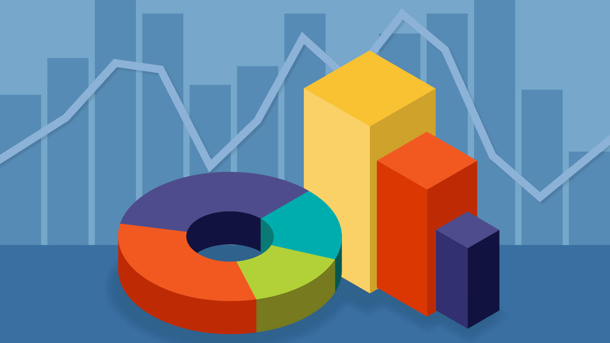

# [Bootcamp Web Developer Full Stack](https://www.thebridge.tech/bootcamps/bootcamp-fullstack-developer/)

### HTML, CSS, JS, ES6, Node.js, Frontend, Backend, Express, React, MERN, testing, DevOps

# Gráficas  
[Chart.js](http://www.chartjs.org/)

**Chart.js** es una librería sin dependencias para construir gráficos de 6 tipos distintos: 
- Lineales
- Barras
- Radiales 
- Circulares 
- Sectores

Es compatible con diseños ***responsives*** y puedes cambiar fácilmente variables como el color o las animaciones para ***personalizar*** aún más la interfaz gráfica.

### Pasos:

**1º** Nos vamos a la biblioteca de gráficas: https://www.chartjs.org/docs/latest/getting-started/

**2º** Leemos la documentación y vamos añadiendo lo que necesitamos para poner nuestra gráfica:

- Añadir Script que llama a la página.
- Añadir el Canvas.
- Añadir código de la gráfica.

* * *

[Chartist.js](http://gionkunz.github.io/chartist-js/)

**ChartistJS** es una gran librería para crear gráficos responsive que hagan uso de SVG. Chartist te otorga flexibilidad mediante una clara separación de sus dos principales componentes: el estilo con css y el control con JS. 

Lo bueno de esta librería es que existen un sinfín de opciones para animar los gráficos utilizando la API de animación de Chartist, SMIL, que te proporciona opciones de animación adicionales.

#### Gráficas avanzadas - D3.js

- [Codepen | CSS 3D Solar System](https://codepen.io/juliangarnier/pen/idhuG)
- [Codepen | D3 canvas globe with country hover](https://codepen.io/jorin/pen/YNajXZ)
- [Codepen | Airport Distance Map](https://codepen.io/shshaw/pen/vJNMQY)

* * * 

### EJERCICIOS

**1.** Insertar el nombre de un pokemon y crear una gráfica que aparezca experiencia, habilidad, peso y altura. [PokeApi](https://pokeapi.co/).

#### Recursos

- [C3 JS](https://c3js.org/): C3 viene con una gran variedad de APIs que puedes utilizar para controlar tus gráficos de forma fácil.

- [Flot](https://github.com/flot/flot): Flot viene con una gran variedad de opciones que puedes añadir en las gráficas que insertes en tu sitio web. 

- [Peity](https://benpickles.github.io/peity/): Es un pequeño plugin de jQuery que transforma un elemento en un mini gráfico lineal, de barras, sectorial o circular SVG.

- [DC JS](https://dc-js.github.io/dc.js/):  DC JS está creada para ayudarte a visualizar datos en navegadores y dispositivos móviles. 
[NVD3](https://nvd3.org/examples/index.html):  Esta librería es por tanto una “plantilla” que te ayudará a construir gráficos de forma sencilla

