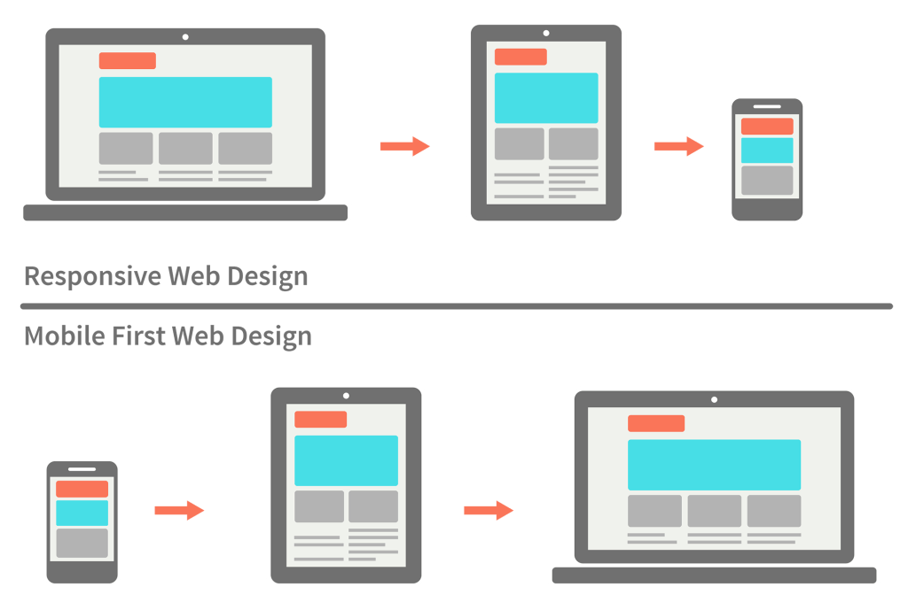

# [Bootcamp Web Developer Full Stack](https://www.thebridge.tech/bootcamps/bootcamp-fullstack-developer/)

### HTML, CSS, JS, ES6, Node.js, Frontend, Backend, Express, React, MERN, testing, DevOps

# Mobile First - Media Queries

### Viewport

El **_viewport_** define el tamaño de la página que el usuario verá según su dispositivo. Anteriormente las páginas tenían un tamaño fijo, sin embargo, tras la llegada de los móviles y tablets, estas no podían adaptarse al tamaño de las nuevas pantallas, por ello, se creó esta solución.

Esta capacidad de adaptarse viene refleja en una de las etiquetas meta de html, que nuestra página debería tener por defecto:

```html
<meta name="viewport" content="width=device-width, initial-scale=1.0" />
```

**_width=device-width_**: Le indica que el ancho de la página debe adaptarse al ancho del dispositivo.
**_initial-scale=1.0_**: El zoom con el que se cargará la página al abrirse.

También fue muy importante la creación de lo que llamamos media **_queries_**. Estas nos permiten definir el ancho o el alto que debe tener una pantalla, para aplicarle una serie de propiedades específicas, que cambiarán al cambiar de dispositivo y por lo tanto la media query.

Las media queries se representan así: _@media_ y llevan asociado consigo aquello que quieren verificar: el ancho o el alto del dispositivo, la orientación, la resolución... La sintaxis sería:

```css
@media screen and (min-device-width: 481px) and (max-width: 600px) {
  div {
    background-color: slateblue;
    width: 200px;
    height: 200px;
  }
}
```

Los tipos de medio que podemos señalar en @media son:

- **all**: le indicamos que es para todos los medios.

- **print**: cuando queremos indicarle que el tamaño se lo dará la impresora.

- **screen**: se refiere a ordenadores, tablets, móviles...

- **speech**: para lectores de pantalla que leen la página en alto.

Respecto a las expresiones, se refieren a una condición en concreto. Las expresiones que más se utilizan se refieren al mínimo y máximo ancho o alto del tamaño en el que se verá el navegador del dispositivo:

- **min-width**: el ancho mínimo con el que se aplicarán las medidas.

- **max-width**: el ancho máximo con el que se aplicarán las medidas.

- **landscape**: en el caso que el ancho de la página sea mayor que el alto, es decir, que se muestre en horizontal.


Los valores más comunes varían un poco, dado que en el mercado siempre se están haciendo nuevas innovaciones, aunque las expresiones que solemos tomar como referencia según el tamaño son las siguientes:

- **Para movil**: no utilizaremos ninguna media query, ya que tomará los valores que posicionamos fuera de los media queries.

- **Para móviles en horizontal y tablets**: @media(min-width: 768px)

- **Para tablets en horizontal y escritorio**: @media(min-width: 1024px)

- **Escritorios muy anchos**: @media(min-width: 1200px)

Lo óptimo es que en nuestro documento de css, utilicemos distintas media queries, para que nuestra página se adapte a la mayor cantidad de dispositivos. Para ello, utilizaremos la filosofía de **mobile first**.

### Mobile First



Mobile First es un concepto de diseño web optimizado para móviles, donde inicialmente se crea una página web para tablets y smartphones, para adaptarla luego a las necesidades de un navegador de escritorio. técnica detrás de una página web.


### Ejercicio

1. Debe tener **Logotipo** una imágen principal que se adapte según:

   - Para **Desktop** debe de estar arriba a la izquierda.
   - Para **Tablet** debe estar arriba centrada y ajustada.
   - Para **Movil** que la imagen se encoja a la mitad y centrada.

2. Crear un **Nav** que tenga 4 items, inicio, contacto, galería y perfil.

   - Para **Desktop** debe de estar arriba en todo el ancho de la web, debajo del logo.
   - Para **Tablet** debe de estar lateral en forma de columna a la derecha.
   - Para **Movil** que esté abajo y se adapte al ancho de la pantalla.

3. Crear un **Footer**

   - Para **Desktop** un Div que contenga el texto "The Bridge" centrado.
   - Para **Tablet** un Div que contenga el texto "The Bridge" centrado.
   - Para **Movil** que se oculte.

#### Recursos

- [Mobile first y posicionamiento](https://www.initcoms.com/que-es-mobile-first-posicionamiento/)
- [Diseño Web - Ionos](https://www.ionos.es/digitalguide/paginas-web/diseno-web/mobile-first-la-nueva-tendencia-del-diseno-web/)
- [Diseño Web responsive vs Mobile first](https://www.novvamarketing.com/blog-marketing-digital/diseno-web-responsive-o-diseno-web-mobile-first/)
- [Viewport](https://www.w3schools.com/css/css_rwd_viewport.asp)
- [Imágenes responsive](https://www.w3schools.com/css/css_rwd_images.asp)
- [Web Design - W3S](https://www.w3schools.com/cssref/css_units.asp)
- [Media Queries I](https://www.w3schools.com/css/css3_mediaqueries.asp)
- [Media Queries II](https://www.w3schools.com/css/css_rwd_mediaqueries.asp)
- [CSS Units](https://webdesign.tutsplus.com/es/articles/7-css-units-you-might-not-know-about--cms-22573)
- [Viewport](https://www.yunbitsoftware.com/blog/2017/06/22/viewport-units-css-que-es/)
- [Apuntes mobile first](https://github.com/TheBridge-FullStackDeveloper/temario-web-app/blob/master/md/bloque02/clase5.md)
