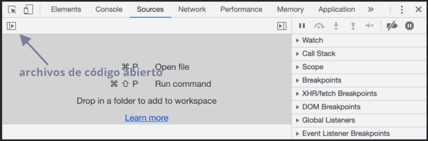
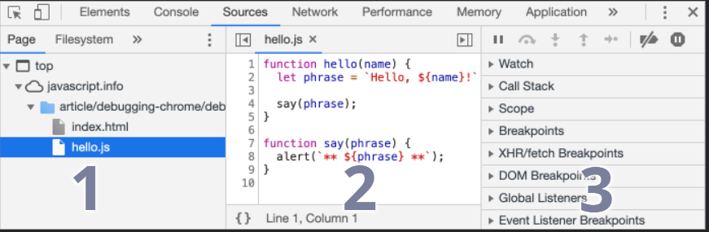
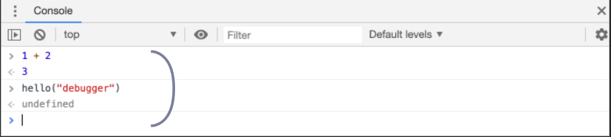
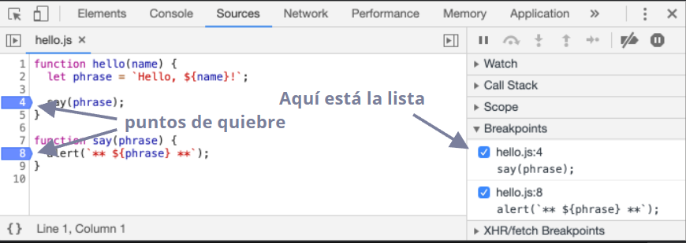
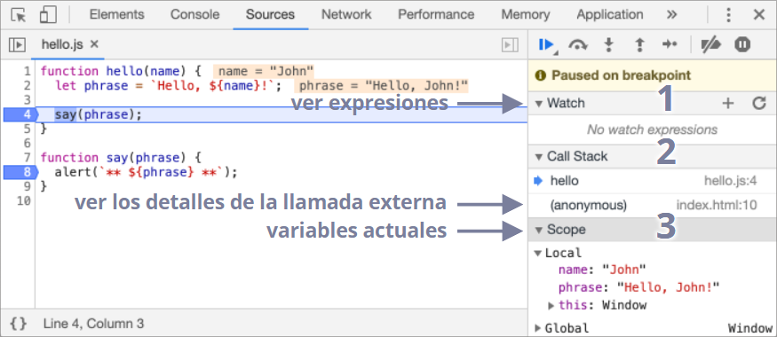
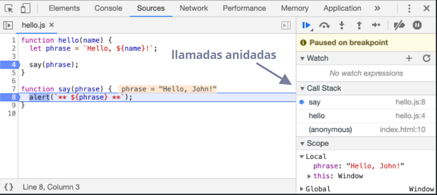
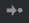
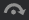

# [Bootcamp Web Developer Full Stack](https://www.thebridge.tech/bootcamps/bootcamp-fullstack-developer/)

### HTML, CSS, JS, ES6, Node.js, Frontend, Backend, Express, React, MERN, testing, DevOps

# Debugging

### Debugging en el navegador

Todos lo exploradores modernos y la mayoría de los otros ambientes soportan el “debugging” – una herramienta especial de UI para desarrolladores que nos permite encontrar y reparar errores más fácilmente. Aquí utilizaremos Chrome porque es uno de los que mejores herramientas tienen en este aspecto.

#### El panel “sources/recursos”

Abrimos esta página para ver el ejemplo: [página de ejemplo](https://es.javascript.info/article/debugging-chrome/debugging/index.html).

*"Tu version de Chrome posiblemente se vea distinta, pero sigue siendo obvio lo que hablamos aquí."*

- Abre la pagina de ejemplo en Chrome.
- Activa las herramientas de desarrollo con F12 (Mac: Cmd+Opt+I).
- Selecciona el panel sources/recursos.
- Esto es lo que debería ver si lo está haciendo por primera vez:



El botón botón de activación (toggle button)  abre la pestaña con los archivos.

Hagamos click allí y seleccionemos **index.html** y luego el **hello.js** que tengamos en el árbol de archivos. Esto es lo que se debería ver: 



**Podemos ver tres zonas:**

1. La **Zona de recursos** lista los archivos HTML, JavaScript, CSS y otros, incluyendo imágenes que están incluidas en la página. Las extensiones de Chrome quizás también aparezcan aquí.

2. La **Zona de código** muestra el código fuente de los archivos.

3. La **Zona de información y control** es para “debugging”, la exploraremos pronto.

Ahora puedes hacer click en el mismo botón de activación  otra vez para esconder la lista de recursos y darnos más espacio.

#### Consola

Si presionamos Esc, la consola se abrirá debajo. Podemos escribir los comandos y presionar Enter para ejecutar. Después de que se ejecuta una sentencia, el resultado se muestra debajo. Por ejemplo, aquí 1+2 da el resultado 3, mientras que la llamada a función hello("debugger") no devuelve nada, entonces el resultado es undefined:



#### Breakpoints (puntos de interrupción)

Examinemos qué pasa con el código de la [página de ejemplo](https://es.javascript.info/article/debugging-chrome/debugging/index.html). En hello.js, haz click en el número de línea 4. Si, en el número 4, no en el código.

¡Felicidades! Ya configuraste un breakpoint. Por favor haz click también en el número de la linea 8.

Debería verse así (en donde está azul es donde deberías hacer click):



Un **breakpoint** es un punto de código donde el debugger pausará automáticamente la ejecución de JavaScript.

Mientras se pausa el código, podemos examinar las variables actuales, ejecutar comandos en la consola, etc. En otras palabras, podemos depurar.

Siempre podemos encontrar una lista de los breakpoints en el panel derecho. Esto es muy útil cuando tenemos muchos breakpoints en varios archivos. Ya que nos permite:

1. Saltar rápidamente al breakpoint en el código (haciendo click en él dentro del panel).

2. Desactivar temporalmente el breakpoint desmarcándolo.

3. Eliminar el breakpoint haciendo click derecho y seleccionando quitar/eliminar/remove.

#### Breakpoints Condicionales

Click derecho en el número de línea nos permite crear un breakpoint condicional. Solo se disparará cuando la expresión dada, que debes proveer cuando la creas, sea verdadera. Esto es útil cuando necesitamos detener la ejecución para un determinado valor de las variables o parámetros de función.

#### El comando “debugger”
También podemos pausar el código utilizando el comando debugger, así:

```js
function hello(name) {
  let phrase = `Hello, ${name}!`;

  debugger;  // <-- the debugger stops here

  say(phrase);
}
```

*Este comando solo funciona cuando el panel de herramientas de desarrollo está abierto, de otro modo el navegador lo ignora.*

#### Pausar y mirar alrededor

En nuestro ejemplo, hello() se llama durante la carga de la página, entonces la forma mas fácil de activar el debugger es recargando la página. Entonces presionemos F5 (en Windows ó Linux) ó Cmd+R (en Mac).

Como el breakpoint está definido, la ejecución se detiene en la línea 4:




Por favor abre el desplegable de información de la derecha (etiquetado con flechas). Este nos permite examinar el estado del código actual:

**1.** ```Watch``` – **muestra el valor actual de cualquier expresión.**

Puedes hacer click en el màs + e ingresar una expresión. El debugger mostrará su valor, y se recalculará automáticamente en el proceso de ejecución.

**2.** ```Call Stack``` – **muestra las llamadas anidadas en la cadena.**

En el momento actual el debugger está dentro de la función ``hello()``, llamada por un script en ```index.html``` (no dentro de ninguna función, por lo que se llama “anonymous”).

Si haces click en un elemento de la pila (por ejemplo “anonymous”), el debugger saltará al código correspondiente, y todas sus variables también serán examinadas.

**3.** ```Scope ```– **variables activas.**

```Local ```muestra las variables de la función local. También puedes ver sus valores resaltados sobre el código fuente.

```Global``` contiene las variables globales (fuera de cualquier función).

También tenemos la palabra ```this``` la cual no estudiaremos ahora, pero pronto lo haremos.

### Trazado de la ejecución

Ahora es tiempo de *trazar*el script.

Hay botones para esto en le panel superior derecho. Revisémoslos.

 **– “Reanudar”: continúa la ejecución, hotkey F8.**
Reanuda la ejecución. Si no hay breakpoints adicionales, entonces la ejecución continúa y el debugger pierde el control.

Esto es lo que podemos ver al hacer click:



La ejecución continuó, alcanzando el siguiente breakpoint dentro de ```say()``` y pausándose allí. Revisa el “Call stack” a la derecha. Ha incrementado su valor en una llamada. Ahora estamos dentro de ```say()```.

 **– “Siguiente paso”: ejecuta el siguiente comando, hotkey F9.**

Ejecuta la siguiente sentencia. Si la cliqueamos ahora, se mostrara ```alert```.

Otro clic volverá a ejecutar otro comando, y así uno por uno, a través de todo el script.

 **– “saltar paso”: corre al comando siguiente, pero no te metas en la función, hotkey F10.**

Similar a “siguiente paso” pero se comporta diferente si la siguiente sentencia es un llamado a función. Esto es: no una nativa como alert, sino una función nuestra.

El comando “siguiente” entra y pausa en la primera línea, en cambio “saltar” ejecuta la función anidada de forma invisible, no mostrando el interior de la función.

La ejecución entonces se pausa inmediatamente despues de esa función.

Es útil si no estamos interesados en ver lo que pasa dentro de la función llamada.

 **– siguiente paso, hotkey F11.**

Similar a “siguiente” pero se comporta diferente en las llamadas asincrónicas. Si apenas comienzas en javaScript, puedes ignorar esto por ahora pues no tenemos llamados asincrónicos aún.

Para el futuro, simplemente recuerda que “Siguiente” ignora las acciones asincrónicas tales como ```setTimeout``` (llamada a función programada), que se ejecutan después. The “Siguiente dentro” va al interior de su código, esperando por él si es necesario. Puedes ver el [DevTools manual](https://developer.chrome.com/blog/new-in-devtools-65/#async) para más detalles.

 **– “Step out”: continuar la ejecución hasta el final de la función actual, hotkey Shift+F11.**

La ejecución se detendrá en la última línea de la función actual. Esto es útil cuando accidentalmente entramos en una llamada anidada usando  que no nos interesa, y queremos continuar hasta el final tan rápido como se pueda.

 **– activar/desactivar todos los breakpoints.**
Este botón no mueve la ejecución. Solo prende y apaga los breakpoints.

 **– activar/desactivar pausa automática en caso de error.**

Cuando está activo y la consola de developers tools esta abierta, un error de script automáticamente pausa la ejecución. Entonces podemos analizar las variables para ver qué está mal. Y si nuestro script muere por un error, podemos abrir el debugger, activar esta opción y recargar la página para ver dónde muere y cuál es el contexto en ese momento.