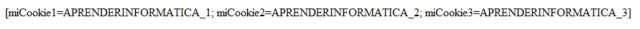

# [Bootcamp Web Developer Full Stack](https://www.thebridge.tech/bootcamps/bootcamp-fullstack-developer/)

### HTML, CSS, JS, ES6, Node.js, Frontend, Backend, Express, React, MERN, testing, DevOps

# Cookies  


Las cookies (o 'galletas', en español) son pequeños archivos que las páginas web guardan (opcionalmente) en el navegador web del usuario, con el fin de guardar configuraciones y obtener otros datos (algunos sitios web las utilizan para recoger información sobre nuestros hábitos y preferencias de navegación, entre otras cosas).

## Crear una cookie

Para usar Cookies en JavaScript en primer lugar hemos de comprobar si están activas en el navegador web del usuario, del siguiente modo:

```javascript
 if( navigator.cookieEnabled == true ) {
    alert("El uso de cookies está activado");
}
else {
    alert("Para activar las cookies debes ir a \n
    'Configuracion / Cookies / Configuración Del Sitio / Cookies y Datos De Sitios");
 }
```

Las Cookies se crean usando la propiedad cookie del objeto Document(), al cual debemos pasar una cadena indicando las siguientes secciones separadas con punto y coma, seguido de un espacio:

1. Nombre y valor de la cookie.
2. Fecha de expiración.
3. Ruta en la que será guardada.

En el siguiente ejemplo creamos dos cookies:

```javascript

//SINTAXIS
document.cookie = "nameCookie=value";"expires=Date"; "path=/"  

//EJEMPLOS 
document.cookie = "miCookie=12;expires=Mon  25 Jun 2022 11:12:13 UTC;  path=/";
document.cookie = "miCookie2=13;expires=Mon  26 Jun 2022 11:12:13 UTC;  path=/";
document.cookie = "miCookie3=14;expires=Mon  27 Jun 2022 11:12:13 UTC;  path=/";
```

## Eliminar cookies

Para eliminar una cookie desde JavaScript se debe asignar una fecha de caducidad (expires) pasada o un max-age igual a cero. En ambos casos da igual el valor que se le asigne a la cookie porque se eliminará pero ha de darse el nombre de la cookie aunque sea sin valor.


Por ejemplo, creamos la cookie con el identificador nombre y valor Miguel igual que antes:

```javascript
document.cookie = "nombre=Miguel";
```
Si queremos eliminarla:

```javascript
document.cookie = "nombre=; expires=Thu, 01 Jan 1970 00:00:00 UTC";

// O con max-age
document.cookie = "nombre=; max-age=0";
```

Al igual que ocurría con la modificación de cookies, para la eliminación el path y el dominio también tienen que coincidir:

```javascript
// Se crean dos cookies con el mismo identificador
// para dos paths diferentes
document.cookie = "nombre=Miguel; path=/noticias";
document.cookie = "nombre=Juan; path=/blog";

// Solo se elimina la cookie del path /noticias
document.cookie = "nombre=; max-age=0; path=/noticias";
```

## Modificar cookies

Por ejemplo, podemos crear la siguiente cookie con identificador nombre y valor Miguel:

```javascript
document.cookie = "nombre=Miguel";
```

Si queremos modificar el valor, por ejemplo cambiarlo por Juan:

```javascript
document.cookie = "nombre=Juan";
```

Es importante tener en cuenta que si una cookie se crea para un dominio o para un path determinado y se quiere modificar, el dominio y el path han de coincidir. De lo contrario se crearán dos cookies diferentes válidas para cada path y dominio. Por ejemplo, imaginemos que estamos en «miweb.com/blog» (el valor predeterminado del path es en este caso /blog):

```javascript
// Supongamos que estamos en "miweb.com/blog"
// y creamos las siguientes cookies

// Creamos la cookie para el path "/"
document.cookie = "nombre=Miguel; path=/";

// Con la siguiente linea se crea una nueva cookie para el path "/blog" (valor por defecto)
// pero no se modifica la cookie "nombre" anterior porque era para un path diferente
document.cookie = "nombre=Juan";

// Con la siguiente línea SI se modifica la cookie "nombre" del path "/" correctamente
document.cookie = "nombre=Juan; path=/";
```
 
### Acceder a las cookies guardadas
Para acceder a las cookies usaremos también la propiedad cookies del Document(), con la que las obtendremos en una cadena de texto:
 
 
```javascript
var misCookies = document.cookie;
document.write( "COOKIES: [" + misCookies + "]" );


//OUTPUT
 COOKIES: [miCookie=12; miCookie2=13; miCookie3=14]

```

Veríamos algo como:



Observa que hay un espacio después del punto y coma de cada cookie creada, a partir de la segunda.

Para leer el valor de cada sección de la cookie debemos obtener la parte de la cadena en que se encuentra (teniendo en cuenta los delimitadores de la misma).

En el siguiente ejemplo creamos unas cookies y a continuación mostramos sus respectivos valores, a partir de la cadena obtenida:


```javascript
// Crear las Cookies:
   document.cookie = "miCookie=12;expires=Mon  25 Jun 2022 11:12:13 UTC;  path=/";
document.cookie = "miCookie2=13;expires=Mon  26 Jun 2022 11:12:13 UTC;  path=/";
document.cookie = "miCookie3=14;expires=Mon  27 Jun 2022 11:12:13 UTC;  path=/";
// Mostrar la cadena con las cookies:
document.write( "COOKIES:" + document.cookie + "<p />" );
 
```
 
## Diferencias entre Cookies y LocalStorage

### Cookies

### Pros  

- Prácticamente todos los comercios electrónicos guardan la información del carrito en la cookie para persistirla y que no desaparezca tras el cierre del navegador.
- Recordar la información del formulario tras el envió del mismo.
- Almacenar preferencias de idioma y moneda.
- Setear una caducidad para la cookie.
- Permite que los servidores web sepan si el usuario ha iniciado sesión en el sitio web.
- Si no se permiten las cookies, el comportamiento anterior no ocurrirá y nunca recordará si se ha iniciado sesión o no.


### Contras

- Los datos no están encriptados.
- El tamaño de la solicitud está limitado a 4KB.
- La inyección de SQL se puede realizar desde una cookie. 

##  LocalStorage

### Pros  

- Se puede acceder a los datos de forma fácil y rápida.
No se requiere de conexión a Internet para acceder a los datos.
- Limite de almacenamiento: 5 MB por origen en Google Chrome, Mozilla Firefox y Opera. 10 MB por área de almacenamiento en Internet Explorer

### Contras
- La información guardada en él, no puede ser accesible directamente desde el servidor.
- Se requiere de copias de seguridad periódicas para evitar la perdida de los datos.
- El usuario es responsable de la seguridad de los datos.

-----

###  Conclusión  

El almacenamiento en las cookies y en el LocalStorage tienen distintos propósitos. Como se ha comentado antes, las cookies pueden ser directamente leídas desde el servidor, en cambio, el LocalStorage solo guarda y permite leer los datos desde el cliente. Las cookies tienen un limite bastante más reducido de almacenamiento en comparación al LocalStorage y éste, técnicamente es más fácil de usar y te permite más con qué trabajar.

Lo que determinaría si se debe o no usar un método u otro para almacenar y persistir los datos del usuario en el sitio web sería si se requiere de estos en el cliente o en el servidor.


### Ejercicios

Se necesita crear un aviso en nuestra página, que notifique a el usuario que se va a hacer **uso de cookies** en nuestra web , y para ello necesitamos:

1. Crea un elemento div en el que el usuario pueda aceptar dichas condiciones

2. Ese mensaje aparecerá en la web hasta que el usuario acepte.Una vez se produzca no mostrar el elemento.

3. Además se require una caducidad de al menos 15 minutos, para comprobar que funciona bien vuestra lógica 


FUENTES:
 
[cybmeta](https://cybmeta.com/cookies-en-javascript#:~:text=Para%20eliminar%20una%20cookie%20desde,cookie%20aunque%20sea%20sin%20valor)


[localstorage-y-cookies-diferencias-y-uso](https://www.drauta.com/localstorage-y-cookies-diferencias-y-uso)
 
 
