# [Bootcamp Web Developer Full Stack](https://www.thebridge.tech/bootcamps/bootcamp-fullstack-developer/)

### HTML, CSS,  JS, ES6, Node.js, Frontend, Backend, Express, React, MERN, testing, DevOps

# Firebase

Firebase es un plataforma que ofrece servicios en la nube, adquirida por Google en 2014 y que proporciona herramientas para (entre otros): 

- BD NoSQL basada en colecciones como hemos visto con MongoDB
- Autenticación segura con diferentes plataformas (Google, Facebook, GitHub...)
- Almacenamiento en servidores para la información de las aplicaciones que desarrollemos

Todo esto sigue un modelo freemium y dispone de varias posibilidades (uso privado/público, con métricas...etc)

## Alta en la plataforma
Lo primero que tenemos que hacer es acceder a [Firebase](https://firebase.google.com/).

Si no hemos accedido nunca, nos pedirá un usuario/contraseña de Google.

## Crear un proyecto

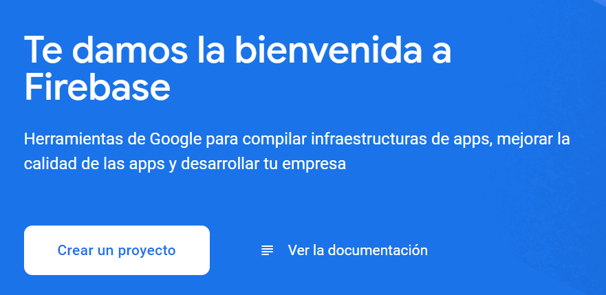

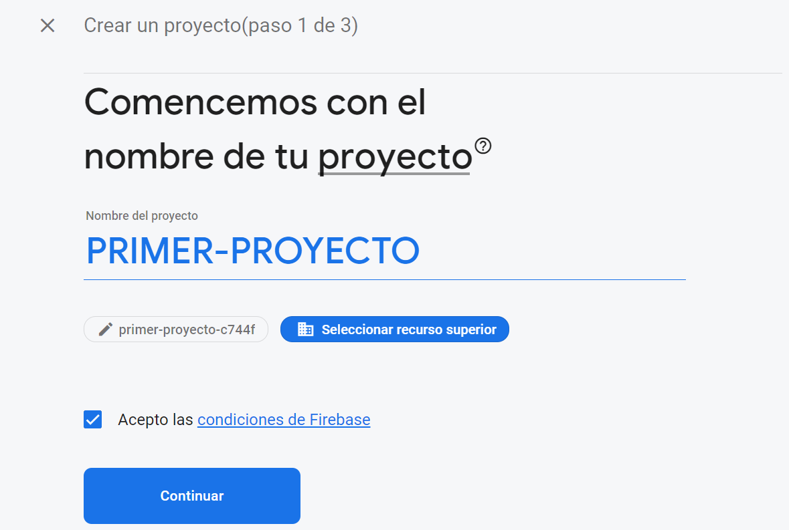

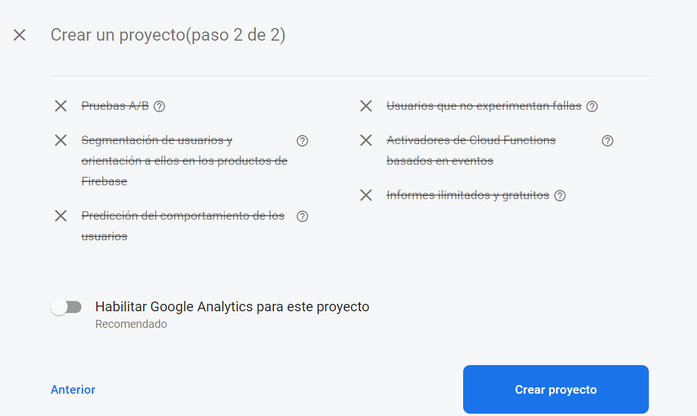

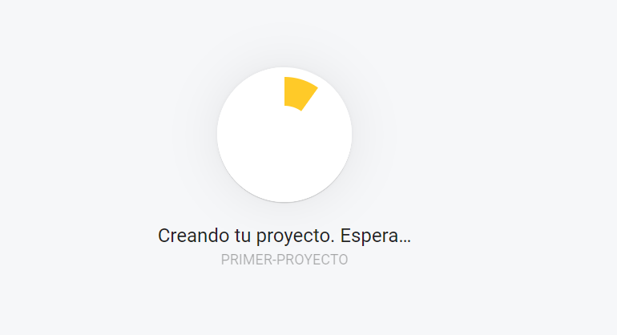

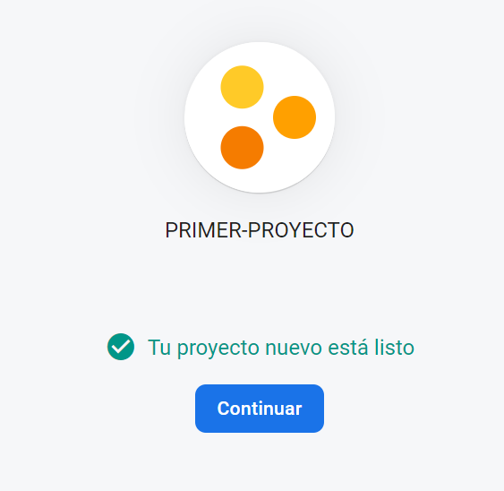

## Configuración inicial

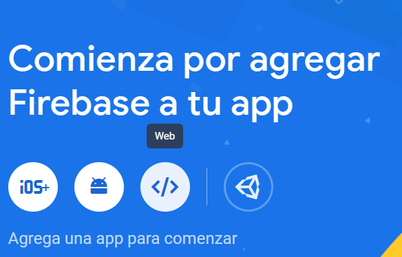

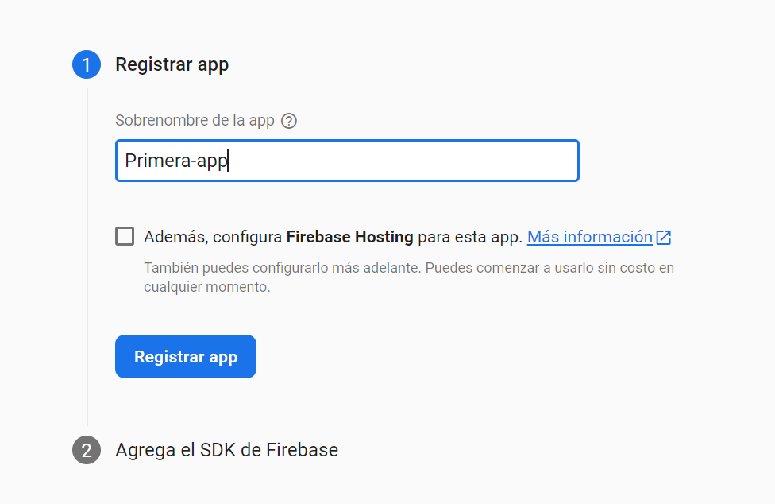

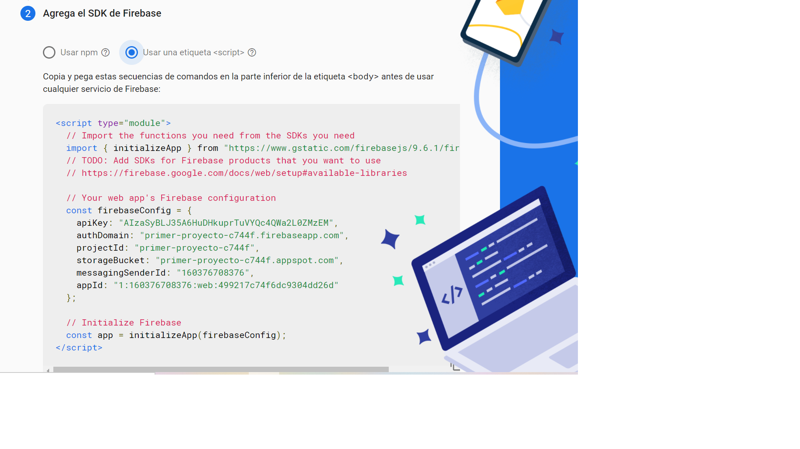

## Crear una BD

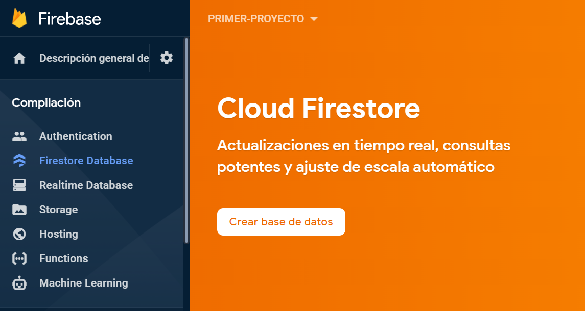

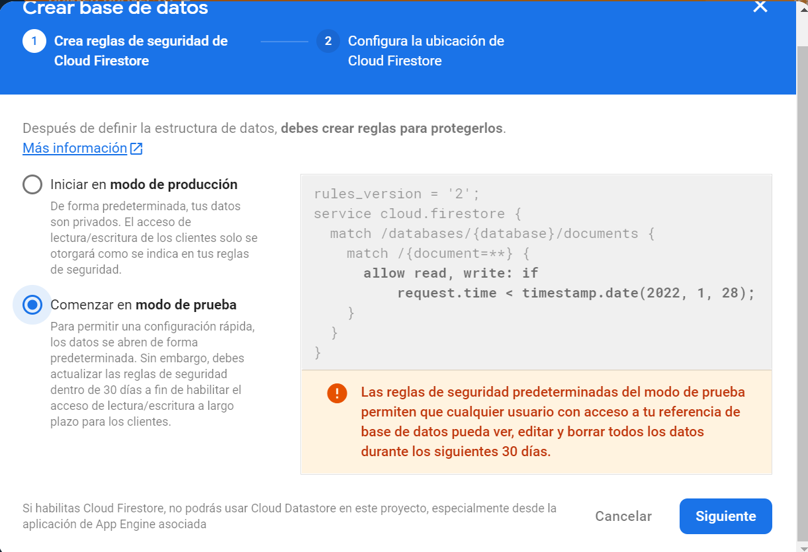

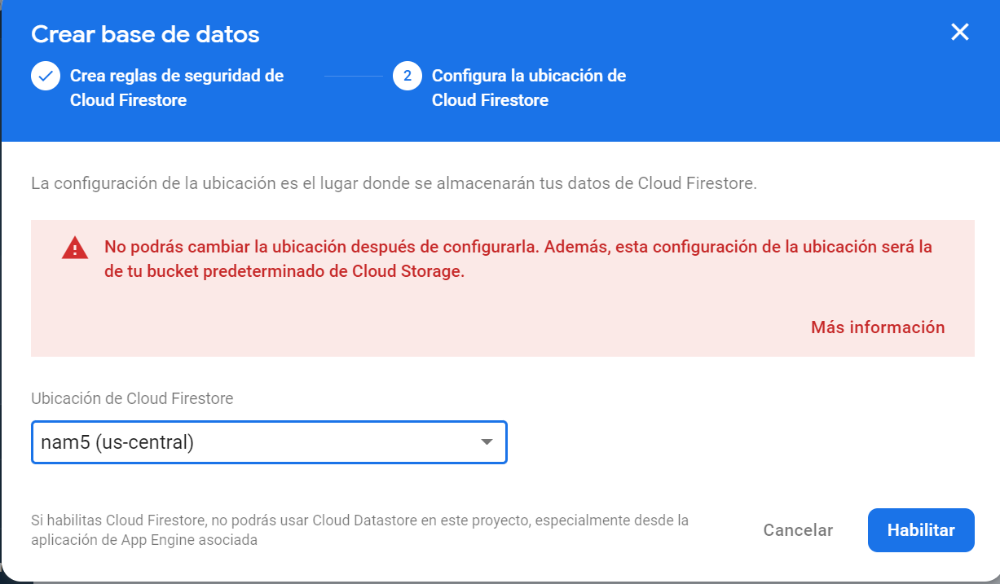

## Crear una colección

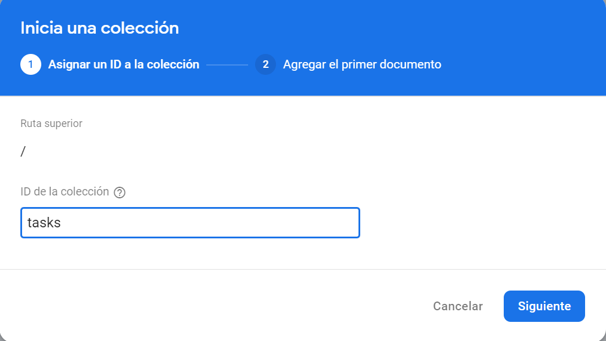

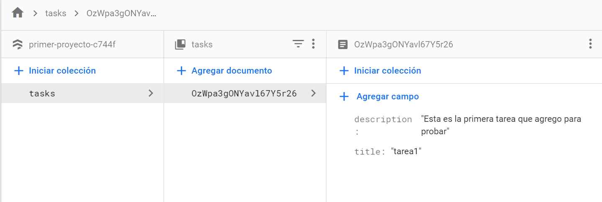

## Documentación 

[DOCUMENTACIÓN_FIREBASE](https://firebase.google.com/docs)

### Ejercicios 
1. Crea en Firebase Firestore una BD que almace la información del ejercicio 3 de JSON. 

- Enunciado del ejercicio: 

A partir de la siguiente información, diseña y elabora un JSON que la contenga y permita acceder de manera lo más sencilla posible, a precio y calorías de cada desayuno.

