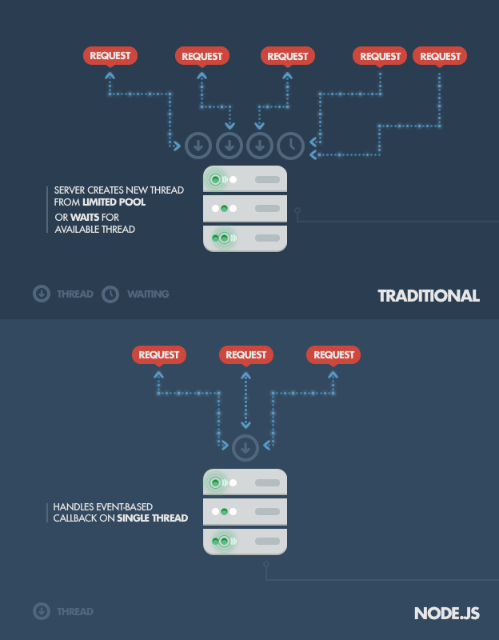

# [Bootcamp Web Developer Full Stack](https://www.thebridge.tech/bootcamps/bootcamp-fullstack-developer/)

### HTML, CSS,  JS, ES6, Node.js, Frontend, Backend, Express, React, MERN, testing, DevOps

# Backend con Node.js


Node.js es un entorno de tiempo de ejecución de JavaScript (de ahí su terminación en .js haciendo alusión al lenguaje JavaScript). Este entorno de tiempo de ejecución en tiempo real incluye todo lo que se necesita para ejecutar un programa escrito en JavaScript.

La ventaja que aporta es que nos permite crear el Backend de nuestra aplicación usando el mismo lenguaje que conocemos en el Frontend.

### Ejemplos de apps Node.js + beneficios de usar Node.js
En el siguiente enlace puedes ver que Node tiene muchas aplicaciones, lo usan Linkedin, la NASA, Netflix...y muchas otras.

- [Ejemplos de apps con Node.js](https://thinkmobiles.com/blog/node-js-app-examples/)

### Node.js - casos de uso - manejo de asincronía
Tradicionalmente se creaba un hilo por petición, Node las agrupa y genera un único hilo, lo que optimiza las ejecuciones.



A continuación dispones de una serie de enlaces en los que puede encontrar más información es este respecto y sobre por qué elegir Node en nuestro Stack: 

- [por-que-demonios-usaria-node-js-un-tutorial-caso-por-caso](https://www.toptal.com/nodejs/por-que-demonios-usaria-node-js-un-tutorial-caso-por-caso)
- [6-awesome-things-you-can-do-with-nodejs](https://www.zeolearn.com/magazine/6-awesome-things-you-can-do-with-nodejs)
- [Pensar asíncronamente en un mundo síncrono](https://medium.com/@ulisesGascon/pensar-as%C3%ADncronamente-en-un-mundo-s%C3%ADncrono-8e25cfcafd83)

### Node.js vs PHP

Veamos ahora una comparativa del manejo de la concurrencia entre Node y PHP:


Podemos ampliar información aquí: 

- [node-js-vs-php](https://www.excellentwebworld.com/node-js-vs-php/)
- [node-js-vs-php-for-backend](https://medium.com/@varshney.shivam786/node-js-vs-php-for-backend-4078a3f65741)

### Gestor de paquetes - NPM 
npm es el sistema de gestión de paquetes (librería, aplicaciones...dependencias en general) por defecto para Node.js, un entorno de ejecución para JavaScript. 

[Wikipedia](https://es.wikipedia.org/wiki/Npm)

## Versiones - Versionado Semántico - SEMVER


**Resumen:**
- Las versiones se construyen con tres números: MAYOR.MENOR.PARCHE (Ej: 5.0.3)

1. La versión MAYOR cuando realizas un cambio incompatible con lo anterior (un cambio mayor. Ej: Añadir una funcionalidad nueva en Whatsapp que no existía: Tratamiento de Audios)
2. La versión MENOR cuando añades funcionalidad que compatible con versiones anteriores (un cambio menor. Ej: Que en Whatsapp los audios ahora se puedan borrar)
3. La versión PARCHE cuando reparas errores compatibles con versiones anteriores (un correctivo. Ej: Los usuarios de Whatsapp de iPhone tienen un problema con los audios mayores de 5 min)

- [SEMVER](https://semver.org/lang/es/)

### Instalar Node.js + Documentación
- [Node.js](https://nodejs.org/en/)
- [instalacion-mac-os](https://conpilar.es/como-instalar-node-js-y-npm-en-mac-os/)

### Ejemplos básicos: 

**Hola Mundo:**

```javascript

    const http = require('http');

    const hostname = '127.0.0.1';
    const port = 3000;

    const server = http.createServer((req, res) => {
    res.statusCode = 200;
    res.setHeader('Content-Type', 'text/plain');
    res.end('Hello World');
    });

    server.listen(port, hostname, () => {
    console.log(`Server running at http://${hostname}:${port}/`);
    });

```
Esto debes ejecutarlo usando node nombrescript.js

**Enrutamiento:**

```javascript

    const http = require('http');

    const hostname = '127.0.0.1';
    const port = 3000;

    const server = http.createServer((req, res) => {

        var url = req.url;
        if (url == '/about') {
            res.write(' Welcome to about us page');
            res.end();
        } else if (url == '/contact') {
            res.write(' Welcome to contact us page');
            res.end();
        } else {
            res.write('Hello World!');
            res.end();
        }
        
    });

    server.listen(port, hostname, () => {
        console.log(`Server running at http://${hostname}:${port}/`);
    });

```

- [Holamundo - Node.js](https://nodejs.org/en/docs/guides/getting-started-guide/)
- [Enrutamiento - Node.js](https://www.geeksforgeeks.org/routing-in-node-js/)

### Uso de módulos con Node.js
Podemos usar módulos (librerías o funciones) ya programados o programar los nuestros.

Las palabras reservadas que vamos a usar son: exports y require, podemos ver un ejemplo en el siguiente enlace: 

- [nodejs_modules - W3schools](https://www.w3schools.com/nodejs/nodejs_modules.asp)

### Routing con Node.js - Ejemplos y enlaces
 - [create-nodejs-web-server | DigitalOcean](https://www.digitalocean.com/community/tutorials/how-to-create-a-web-server-in-node-js-with-the-http-module-es)
 - [routing-in-node-js](https://www.geeksforgeeks.org/routing-in-node-js/)

### Instalar paquetes con NPM


- [dependencies-vs-devdependencies](https://medium.com/@stalonadsl948/dependencies-vs-devdependencies-926e096a3dee)


### NPM Scripts
**Pasos:**
1. Ejecutar npm init
2. Rellenar el fichero package.json y dejarlo con un aspecto similar a este: 

```javascript
    {
      "name": "npm-scripts",
      "version": "1.0.0",
      "description": "",
      "main": "script.js",
      "scripts": {
        "test": "echo \"Error: no test specified\" && exit 1",
        "start":"node script.js"
      },
      "author": "Autor",
      "license": "ISC"
    }

```
3. Ejecutar npm start

- [npm-scripts](https://sodocumentation.net/es/npm/topic/4842/npm-scripts)
- [Run-scripts-with-npm](https://www.codeblocq.com/2015/12/Run-scripts-with-npm/)
- [que-son-los-scripts-npm-y-como-se-activan](https://riptutorial.com/es/npm/example/32766/-que-son-los-scripts-npm-y-como-se-activan-)

### EJERCICIOS
Routing con Node.js: 
1.  Crea rutas básicas para servir una página web clásica
(Home| ¿Quiénes somos? | ¿Dónde Estamos? | ¿Qué hacemos? | Contacto... etc...)
2. Modifica el apartado anterior y crea código HTML para cada petición a la ruta (endpoint) en concreto
3. Ahora modifica el apartado anterior y sirve en respuesta a la petición de cada ruta(endpoint) los ficheros HTML correspondientes: home.html, contact.html, about.html...
4. Realiza las modificaciones necesarias para que nuestro script se ejecute con **npm start**.

**Ejemplo diferentes ficheros HTML:**

```javascript

    const http = require('http');
    const fs = require('fs');
    const server = http.createServer((req, res) => {
        console.log(req.url)
        res.setHeader('Content-Type', 'text/html');
        let route = './';
        switch (req.url) {
            case '/':
                route += 'index.html';
                break;
            default:
                route += '404.html'
                break;
        }
        fs.readFile(route, (err, data) => {
            if (err) {
                console.log(err)
                res.end()
            } else {
                res.end(data);
            }
        })
    })
    server.listen(3000, 'localhost', () => {
        console.log('listening for request on port 3000');
    })

```

**Endpoints de ejemplo:**

```javascript

    GET http://localhost:3000/
    GET http://localhost:3000/about
    GET http://localhost:3000/location
    GET http://localhost:3000/mission
    GET http://localhost:3000/contact

```

### Cheatsheets
- [NPM cheatsheet](https://devhints.io/npm)
- [npm-cheat-sheet-most-common-commands-and-nvm](https://www.freecodecamp.org/news/npm-cheat-sheet-most-common-commands-and-nvm/)
- [nodejs Cheatsheet](https://overapi.com/nodejs)
- [npm-tutorial](https://codingpotions.com/npm-tutorial)
