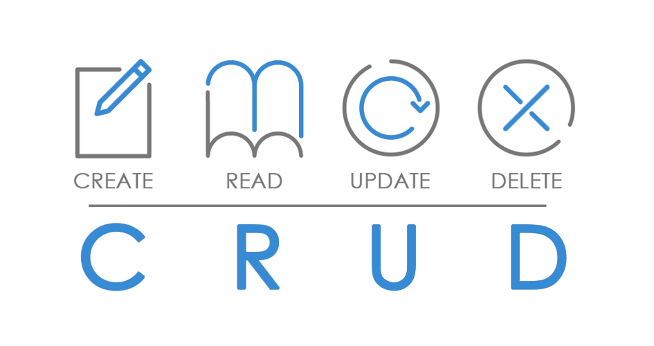

# [Bootcamp Web Developer Full Stack](https://www.thebridge.tech/bootcamps/bootcamp-fullstack-developer/)

### HTML, CSS,  JS, ES6, Node.js, Frontend, Backend, Express, React, MERN, testing, DevOps

# CRUD MongoDB Node

En informática, CRUD es el acrónimo de "Crear, Leer, Actualizar y Borrar", que se usa para referirse a las funciones básicas en bases de datos o la capa de persistencia en un software. 

[Wikipedia](https://es.wikipedia.org/wiki/CRUD)




Lo primero que debemos hacer es instalar MongoDB en nuestro proyecto para poder usar las funciones de la librería: 

```javascript

npm install mongodb


```
A continuación vamos a ver el script que realiza un CRUD por partes: 

### Primera parte: Incluir el módulo y definir constantes y variables necesarias: 

```javascript

    const mongo = require('mongodb');
    const MongoClient = mongo.MongoClient;

    const mydb = "Empresa";
    const coleccion = "Clientes";

    const url = "mongodb://localhost:27017/";

    const myobj = { "nombre": "Ana", "direccion": "C/Alcalá 1" };

```

### Segunda parte: Creación de una BD y una colección

Como ya vimos en nuestra instalación inicial, cuando vamos a crear una BD debemos crear la colección correpondiente, es por esto que lo que se hace a efectos prácticos es conectarnos a una BD (si no existe se crea) y dentro de ella crear una colección nueva, para ello usaremos nuestras constantes **mydb** y **coleccion**:

```javascript

    //Creacion de una BD 
    MongoClient.connect(url+mydb, function(err, db) {
    if (err) throw err;
    console.log("Base de datos creada");
    db.close();
    });

    //Creacion de una coleccion dentro de una BD
    MongoClient.connect(url, function(err, db) {
    if (err) throw err;
    var dbo = db.db(mydb);
    dbo.createCollection(coleccion, function(err, res) {
        if (err) throw err;
        console.log("Colección creada");
        db.close();
    });
    });

```

### Tercera parte: Inserción de un documento dentro de una colección

Para insertar debemos disponer del nombre de la BD (en nuestro caso **mydb**) y de la colección (en nuestro caso **coleccion**); además hemos creado un objeto que contiene los datos que vamos a insertar, llamado **myobj**.

```javascript 

    //Insertar dentro de una coleccion de una BD
    MongoClient.connect(url, function(err, db) {
    if (err) throw err;
    var dbo = db.db(mydb);
    
    dbo.collection(coleccion).insertOne(myobj, function(err, res) {
        if (err) throw err;
        console.log("Documento insertado");
        db.close();
    });
    });

```

### Cuarta parte: Búsquedas


```javascript 

    //Obtener datos del primer elemento dentro de una coleccion
    MongoClient.connect(url, function(err, db) {
    if (err) throw err;
    var dbo = db.db(mydb);
    dbo.collection(coleccion).findOne({}, function(err, result) {
        if (err) throw err;
        console.log(result.nombre);
        db.close();
    });
    }); 

    //Ver todos 
    MongoClient.connect(url, function(err, db) {
    if (err) throw err;
    var dbo = db.db(mydb);
    dbo.collection(coleccion).find({}).toArray(function(err, result) {
        if (err) throw err;
        console.log(result);
        db.close();
    });
    });


    //Query simple  
    MongoClient.connect(url, function(err, db) {
        if (err) throw err;
        var dbo = db.db(mydb);
        var query = { "direccion": "C/Alcalá 1" };
        dbo.collection(coleccion).find(query).toArray(function(err, result) {
        if (err) throw err;
        console.log(result);
        db.close();
        });
    });

    //Sort por un criterio (campo)
    MongoClient.connect(url, function(err, db) {
        if (err) throw err;
        var dbo = db.db(mydb);
        var mysort = { "nombre": 1 };
        dbo.collection(coleccion).find().sort(mysort).toArray(function(err, result) {
        if (err) throw err;
        console.log(result);
        db.close();
        });
    }); 


    //Busquedas paginadas
    MongoClient.connect(url, function(err, db) {
        if (err) throw err;
        var dbo = db.db(mydb);
        dbo.collection(coleccion).find().limit(3).toArray(function(err, result) {
        if (err) throw err;
        console.log(result);
        db.close();
        });
    });

```

### Quinta parte: Borrar

Podemos borrar documentos o borrar colecciones: 

```javascript 

    //Borrar  
    MongoClient.connect(url, function(err, db) {
        if (err) throw err;
        var dbo = db.db(mydb);
        var myquery = { "direccion": 'C/Alcalá 1' };
        dbo.collection(coleccion).deleteOne(myquery, function(err, obj) {
        if (err) throw err;
        console.log("Documento borrado");
        db.close();
        });
    });

    //Borrar coleccion
    MongoClient.connect(url, function(err, db) {
      if (err) throw err;
      var dbo = db.db(mydb);
      dbo.collection(coleccion).drop(function(err, delOK) {
          if (err) throw err;
          if (delOK) console.log("Coleccion borrada");
          db.close();
      });
    });

```

### Sexta parte: Actualizaciones 

```javascript

    MongoClient.connect(url, function(err, db) {
        if (err) throw err;
        var dbo = db.db(mydb);
        var myquery = { "direccion": "C/Alcalá 1" };
        var newvalues = { $set: {"nombre": "Pedro SL", "direccion": "C/Serrano" } };
        dbo.collection(coleccion).updateOne(myquery, newvalues, function(err, res) {
        if (err) throw err;
        console.log("Documento actualizado");
        db.close();
        });
    });

```

## Ejercicios

1. Prueba todos los ejemplos
2. Realiza una aplicación que permita crear una BD en MongoDB pidiendo al usuario el nombre de la misma, el nombre de la primera colección y los datos del primer documento, obtén una captura de pantalla desde MongoDB
3. Realiza una aplicación que permita mostrar insertar, borrar, actualizar o mostrar información en la colección de la BD del ejercicio anterior.

Ojo: Todos los ejercicios deben ejecutarse con npm start y realizarse solamente en dos páginas (el index y la respuesta que se da desde node con express)

