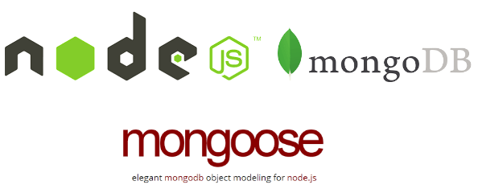
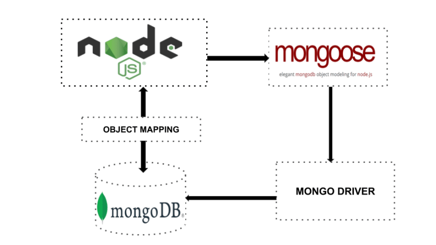

# [Bootcamp Web Developer Full Stack](https://www.thebridge.tech/bootcamps/bootcamp-fullstack-developer/)

### HTML, CSS,  JS, ES6, Node.js, Frontend, Backend, Express, React, MERN, testing, DevOps

# Mongoose 






Mongoose es un Object Document Mapper (ODM). Esto significa que Mongoose permite definir objetos con un esquema fuertemente tipado que se asigna a un documento MongoDB.

Proporciona muchas funcionalidades para crear y trabajar con esquemas. Actualmente contiene ocho **SchemaTypes**, lo que nos permite definir las estructuras de nuestros documentos.

Los **SchemaTypes** son:

- String: Cadena de caracteres.
- Number: Números que pueden tener hasta 64 bit.
- Boolean: True o false.
- Buffer: Tipos binarios como imágenes, pdfs, etc.
- Date: Fechas en formato ISO.
- Array
- Schema.Types.ObjectId: String hexadecimal utilizado por MongoDB como identificador.
- Schema.Types.Mixed: Cualquier tipo de datos (flexible). (Ojo: Con este tipo de cambios no se confirman los cambios sin llamar a una función propia de Mongoose.)

Para poder ver cómo podemos trabajar con Mongoose, debemnos ir paso a paso siguiendo un ejemplo: 

### Primera parte: Instalar mongoose en Node

Como ya hemos hecho anteriormente debemos instalar mongoose en nuestro proyecto, esto lo vamos a hacer por medio de nuestro gestor de paquetes de Node, npm, con el siguiente código: 

```
    npm install mongoose
```
### Segunda parte: conectar con MongoDB por medio de mongoose en Node

Veamos ahora un script que abre la conexión y la cierra: 

```javascript 

    const mongoose = require("mongoose");

    const url = "mongodb://localhost:27017/test";
    mongoose.connect(url);

    mongoose.connection.on("error", function (e) { console.error(e); });

    mongoose.disconnect();

```
Podemos ver que hay una línea de código que está manejando el error, en el siguiente enlace podemos ver dos opciones para manejar los errores, uno como está realizado en el ejemplo (Ojo: console.error es un stream de salida por consola, específico para errores)

[MANEJADORES_DE_ERROR](https://mongoosejs.com/docs/connections.html#error-handling)

También podríamos hacer algo como lo siguiente para manejar errores: 

```javascript 

    const mongoose = require("mongoose");

    const url = "mongodb://localhost:27016/test";

    async function conn(url) {
        try {
            await mongoose.connect(url);
        } catch (error) {
            console.error(error);
        }
        mongoose.disconnect();
    }
    conn(url);

```
De este modo nos aseguramos de conectarnos o de manejar el error, en caso de que se produzca.

Veamos una tercera manera de abrir la conexión, que recuerda a la usada con MongoDB en el CRUD: 

```javascript

    const mongoose = require("mongoose");

    const url = "mongodb://localhost:27017/test";

    mongoose.connect(url, function(err){
        if (err) throw err;
        console.log("Conexión correcta");
    });
    mongoose.disconnect();

```

Esto lo podemos hacer con otras opciones (usando promesas por ejemplo), tendremos un manual al final de esta teoría que podrán seguir.

### Tercera parte: Creación de esquema, de objeto y escribir en la BD

```javascript

    const mongoose = require("mongoose");

    const url = "mongodb://localhost:27017/test";

    mongoose.connect(url, function(err){
        if (err) throw err;
        console.log("Conexión correcta");
    });

    const objectSchema = {
        _id: mongoose.Schema.Types.ObjectId,
        name: {
            firstName: String,
            lastName: String
        }, 
        created: Date, 

    };
    const userSchema = mongoose.Schema(objectSchema);

    let User = mongoose.model('User', userSchema);
    let davinia = {
        _id: new mongoose.Types.ObjectId(),
        name: {
            firstName: 'Davinia',
            lastName: 'de la Rosa'
        }, 
        created: Date.now()
    };
    let userDavinia = new User (davinia);

    userDavinia.save(function(err){
        if (err) throw err;
        console.log("Inserción correcta");
        mongoose.disconnect();
    });

```
### Cuarta parte: Validación de datos

Podemos incluir por medio de mongoose, usando una estructura con valores fijos, validaciones.

Veamos un ejemplo, incluyendo la url de Linkedin de los usuarios: 

```javascript

    const mongoose = require("mongoose");

    const url = "mongodb://localhost:27017/test";

    mongoose.connect(url, function(err){
        if (err) throw err;
        console.log("Conexión correcta");
    });

    const objectSchema = {
        _id: mongoose.Schema.Types.ObjectId,
        name: {
            firstName: String,
            lastName: String
        }, 
        created: Date, 
        linkedin: {
            type: String,
            validate: {
                validator: function(urlLinkedin){
                    return urlLinkedin.indexOf('https://www.linkedin.com/') == 0;
                }, 
                message: "Linkedin Incorrecto"
            }
        }
    };
    const userSchema = mongoose.Schema(objectSchema);

    let User = mongoose.model('User', userSchema);
    let davinia = {
        _id: new mongoose.Types.ObjectId(),
        name: {
            firstName: 'Davinia',
            lastName: 'de la Rosa'
        }, 
        created: Date.now(), 
        linkedin: "https://www.linkedin.com/daviniadelarosahernandez"
    };
    let userDavinia = new User (davinia);

    userDavinia.save(function(err){
        if (err) throw err;
        console.log("Inserción correcta");
        mongoose.disconnect();
    });

//mongoose.disconnect();


```

Modifica la url que se le coloca al usuario y verifica que se obtiene una excepción con el mensaje indicado por el validador diseñado.


### Quinta parte: Búsquedas

Podemos usar **findById**: 

Veamos cómo: 

```javascript

    User.findById('6188559ab4294928976e8aab', function(err, user){
        if (err) throw err;
        console.log("User con id 6188559ab4294928976e8aab:\n"+user);
        mongoose.disconnect();
    });

```
Podemos añadir a **find**

Veamos cómo: 

```javascript

    User.find({
        linkedin: "https://www.linkedin.com/daviniadelarosahernandez"
    }).exec(function(err, users){
        if (err) throw err;
        console.log("Users:\n"+users);
        mongoose.disconnect();
    });    

```
### Sexta parte: Actualizaciones

Para actualizar, lo que hacemos es buscar, cambiar el campo que queramos y volver a escribir: 

Veamos un ejemplo: 

```javascript

    User.findById('6188559ab4294928976e8aab', function(err, user){
        if (err) throw err;
        user.linkedin = "https://www.linkedin.com/davinia2";
        user.save(function(err){
            if (err) throw err;
            console.log("Actualización correcta");
            mongoose.disconnect();
        });
        
    });

```
[BÚSQUEDAS AVANZADAS](https://charlascylon.com/2013-07-10-tutorial-mongodb-operaciones-de-consulta-avanzadas)
[AYUDA RELACIÓN COLECCIONES](https://es.stackoverflow.com/questions/94131/relacionar-dos-modelos-en-mongodb)

### Séptima parte: Borrado

Para borrar, buscamos primero y luego usamos el método delete: 

```javascript

    User.findById('6188559ab4294928976e8aab', function(err, user){
        if (err) throw err;
        user.remove(function(err){
            if (err) throw err;
            console.log("Borrado correcto");
            mongoose.disconnect();
        }); 
    });

```

[MANUAL](https://code.tutsplus.com/es/articles/an-introduction-to-mongoose-for-mongodb-and-nodejs--cms-29527)

[DOCUMENTACIÓN](https://mongoosejs.com/docs/)

[PROYECTO_NACHO](https://github.com/igonzaleztb/CRUDPUG)


