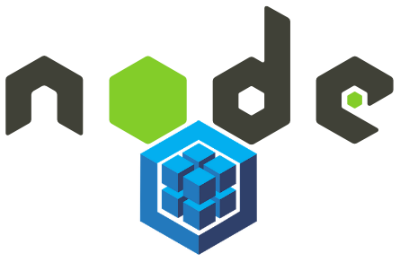

# [Bootcamp Web Developer Full Stack](https://www.thebridge.tech/bootcamps/bootcamp-fullstack-developer/)

### HTML, CSS,  JS, ES6, Node.js, Frontend, Backend, Express, React, MERN, testing, DevOps


# Primer ejemplo Sequelize



### Preparativos: 
```sql

    #DROP DATABASE test;
    CREATE DATABASE test;
    USE test;
    CREATE TABLE users(
        id INT AUTO_INCREMENT,
        firstname VARCHAR(100),
        lastname VARCHAR(200),
        PRIMARY KEY(id)
    ); 
    
    INSERT INTO users VALUES(NULL, "Davinia", "de la Rosa");

```

### Script inicial

Se debe crear antes de iniciar, un proyecto node e instalar **sequelize**, **mysql** y **mysql2**.

Además se debe crear una BD en Workbench la BD facilitada en preparativos.


```javascript 

    const Sequelize = require('sequelize')

    const sequelize = new Sequelize('test', 'root', 'root', {
        host: 'localhost',
        dialect: 'mysql',
        port: 3306
    })

    sequelize.authenticate()
        .then(() => {
            console.log('Conectado')
        })
        .catch(err => {
            console.log('No conectado: '+ err)
        });

    const Users = sequelize.define('users', {
        id: { type: Sequelize.INTEGER, primaryKey: true },
        firstname: Sequelize.STRING,
        lastname: Sequelize.STRING
    });

    Users.findAll({ attributes: ['id', 'firstname', 'lastname'] })
        .then(users => {
            console.log(users[0].dataValues)
        })
        .catch(err => {
            console.log(err)
        });


```