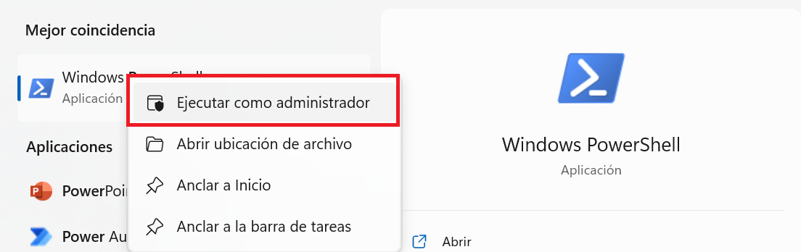
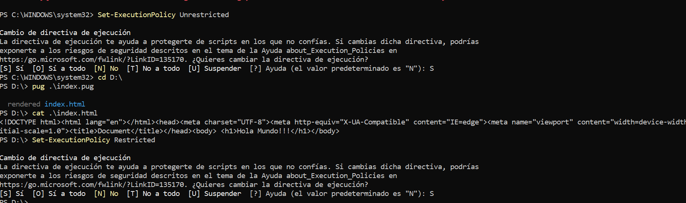
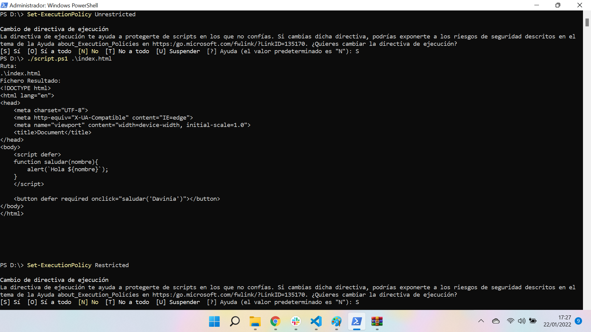
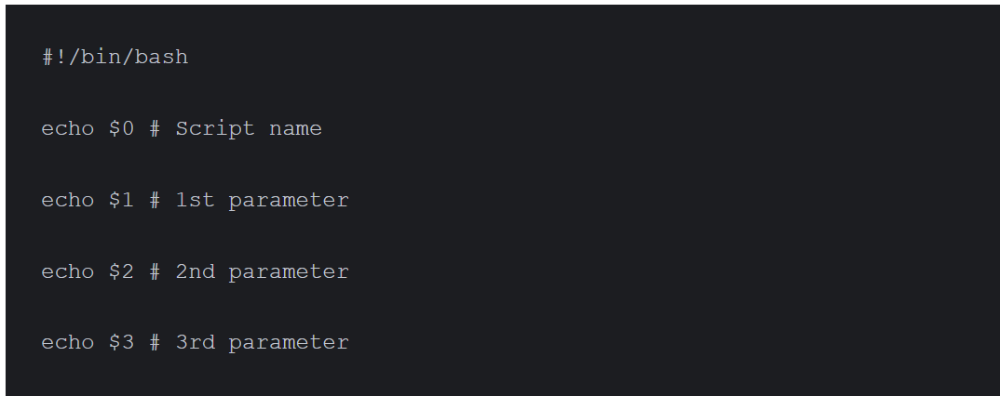

# [Bootcamp Web Developer Full Stack](https://www.thebridge.tech/bootcamps/bootcamp-fullstack-developer/)

### HTML, CSS,  JS, ES6, Node.js, Frontend, Backend, Express, React, MERN, testing, DevOps

# Pug


Pug (anteriormente conocido como Jade) es un motor de plantilla de Node. js. con el que seremos capaces de escribir código HTML de una sintaxis mucho más sencilla, clara y directa, tanto a la hora de escribir como de leer y modificar. 

Vamos a ver el primer ejemplo: 

Pasos: 
1. Crea un nuevo directorio para un proyecto node e instala pug

```
    npm install pug

```
2. Crea el fichero view.pug que va a contener nuestra plantilla pug

**view.pug:**

```

    p Hello World, #{name}!

```

3. Crea index.js con el código siguiente


**index.js:**

```javascript

    // Import the pug module
    const pug = require('pug');

    // Compile the template (with the data not yet inserted)
    const templateCompiler = pug.compileFile('view.pug');

    // Insert your data into the template file
    console.log(templateCompiler({ name: 'Davinia' }));

```

Lo que podemos ver es que pug usando una sintaxis relativamente más sencilla y que se puede automatizar, podremos crear HTML de manera dinámica y compilando las plantillas que desarrollemos o creemos de forma dinámica.

Veamos otra manera de crear nuesto código HTML usando la terminal y generando un fichero por medio del compilador.

Pasos:
1. Abrir PowerShell como administrador



2. Instalar el cliente de pug para poder realizar tareas en la terminal

```
    npm install -g pug-cli

```

3. Crear tu plantilla pug: 

**index.pug:**

```

    doctype html
    html(lang="en")
    head
        meta(charset="UTF-8")
        meta(http-equiv="X-UA-Compatible", content="IE=edge")
        meta(name="viewport", content="width=device-width, initial-scale=1.0")
        title Document
    body 
        h1 Hola Mundo!!!

```

4. Ejecutar los siguientes comandos: 



Lo primero que estamos haciendo es permitir la ejecución de scripts desde la terminal (sin restricciones). Esta opción viene deshabilitada por seguridad.

A continuación con la llamada a pug con el fichero de la plantilla lo que estamos haciendo es compilar desde la termminal nuestra plantilla y generar el fichero HTML con el contenido indicado en la misma

Por último restablecemos la seguridad, impidiendo de nuevo la ejecución de scripts en la terminal.

## Nociones básica para generar las plantillas

### Etiquetas y contenido
- Para expresar una etiqueta dentro de una plantilla pug, lo único que debemos hacer es colocar dentro de la plantilla su nombre (sin corchetes angulares)

- El cotenido se expresa tras un espacio seprándolo del nombre de la etiqueta.

Ejemplo: 

```

    h1 Título principal
    p Esto es un párrafo

```

El resultado de compilar esta plantiila pug sería: 

```HTML

    <h1>Título principal</h1>
    <p>Esto es un párrafo</p>

```

### Anidar etiquetas
Para hacerlo basta con colocar saltos de línea y tabuladores, del mismo modo que indentamos nuestro código habitualmente.

**Ejemplo de plantilla:**

```
    form
        div         
            p Este es un párrafo
            small Este es un texto pequeño
                b Este es un bold dentro del small
```

**Resultado de la compilación:**

```HTML

    <form>
        <div>
            <p>Este es un párrafo</p>
            <small>Este es un texto pequeño<b>Este es un bold dentro del small</b></small>
        </div>
    </form>

``` 

### Atributos en las etiquetas
Los atributos se expresan entre paréntesis asociados al identificador de la etiqueta.

La sintaxis (para un atributo) es la siguiente: 

```
    etiqueta(atributo="valorDelAtributo") 

```

Si quisiéramos añadir más de un atributo a la etiqueta los separamos por espacios.

Veamos un ejemplo: 

**Ejemplo de plantilla:**

```

   a(href="http://www.google.com" target="_blank") Google

```

**Resultado de la compilación:**

```HTML

   <a href="http://www.google.com" target="_blank">Google</a>

``` 

Otro ejemplo más complejo:

**Ejemplo de plantilla:**

```

    form(method="POST" action="pagina.php")
        input(type="text")
        button(type="submit") Aceptar

```

**Resultado de la compilación:**

```HTML

    <form method="POST" action="pagina.php">
        <input type="text" />
        <button type="submit">Aceptar</button>
    </form>

``` 
### Id y valor
1. Lo puedes tratar como un atributo más (porque lo es):


**Ejemplo de plantilla:**

```

   a(href="http://www.google.com" target="_blank" class="btn btn-primary" id="boton") Google

```

**Resultado de la compilación:**

```HTML

   <a href="http://www.google.com" target="_blank" class="btn btn-primary" id="boton">Google</a>

``` 

2. O puedes usar la sintaxis CSS (por comodidad): 

**Ejemplo de plantilla:**

```

   a#boton.btn(href="http://www.google.com" target="_blank") Google

```

**Resultado de la compilación:**

```HTML

   <a class="btn" id="boton" href="http://www.google.com" target="_blank">Google</a>

``` 

### Añadir scripts 

- Con un script externo: 

**Ejemplo de plantilla:**

```

   script(src="js/archivo.js", defer="")

```

**Resultado de la compilación:**

```HTML

  <script src="js/archivo.js" defer=""></script>

``` 

- Con el código js embebido: Usamos el .


**Ejemplo de plantilla:**

```

   script.
    function saludar(nombre){
        alert(`Hola ${nombre}`);
    }

```

**Resultado de la compilación:**

```HTML

    <script>
        function saludar(nombre) {
            alert(`Hola $ {nombre}`);
        }
    </script>

``` 

**Solución Atritbutos sin valor: (Ej: defer o require)**
Nos podemos encontrar atributos como defer o require que no tiene que tener valor y en ese caso pug crea el HTML con algo como defer="". 

Los siguientes scripts solucionan el problema sin tener que editar el fichero a mano: 

**PowerShell (Windows):**

```PowerShell

    Param(
        [string] $Ruta
    )
    Write-Host 'Ruta:'
    Write-Host $Primero

    ((Get-Content -Path $Ruta -Raw) -replace 'defer=""','defer') | Set-Content -Path $Ruta
    ((Get-Content -Path $Ruta -Raw) -replace 'required=""','required') | Set-Content -Path $Ruta
    Write-Host 'Fichero Resultado:' 
    Get-Content -path $Ruta

```

Fichero al que se le aplica, resultado de compilar en pug: 

**index.html:** 
```HTML
    <!DOCTYPE html>
    <html lang="en">
    <head>
        <meta charset="UTF-8">
        <meta http-equiv="X-UA-Compatible" content="IE=edge">
        <meta name="viewport" content="width=device-width, initial-scale=1.0">
        <title>Document</title>
    </head>
    <body>
        <script defer>
        function saludar(nombre){
            alert(`Hola ${nombre}`);
        }
        </script>

        <button defer="" required="" onclick="saludar('Davinia')"></button>
    </body>
    </html>

```
La ejecución se lleva a cabo de la siguiente manera (ten en cuenta que debemos poner la ruta absoluta o relativa correcta de la ubicación del archivo):




**Bash (Unix):**

En unix los parámetros no hay que indicarlos, van numerados de la siguiente forma: 




Y el script quedaría: 

```sh

    sed -i 's/defer=""/defer/g' $1 
    sed -i 's/require=""/require/g' $1 
    cat $1

```

### Añadir estilos

La manera de confeccionar las plantillas es análogo a lo que hicimos en el apartado anterior con la etiqueta script:


**Ejemplo de plantilla:**

```

    link(rel="stylesheet", href="style.css")

    style.
        .rojo{
            color: red;
        }

    a(href="#" style={color:"red", "font-size":"2em"}) Link

```

**Resultado de la compilación:**

```HTML

   <link rel="stylesheet" href="style.css"/>
   <style>
    .rojo{
        color: red;
    }
    </style>
    <a href="#" style="color:red;font-size:2em;">Link</a>

``` 

## Extras

### Omitir la etiqueta div

**Ejemplo de plantilla:**

```

    .container
        a.link(href="#") Link
    #otroDiv
        a.link(href="#") Link

```

**Resultado de la compilación:**

```HTML

    <div class="container"><a class="link" href="#">Link</a></div>
    <div id="otroDiv"><a class="link" href="#">Link</a></div>

```

### Anidar sin salto de línea

Se usa **:**

**Ejemplo de plantilla:**

```

    div.container: a.link(href="#") Link

```

**Resultado de la compilación:**

```HTML

    <div class="container"><a class="link" href="#">Link</a></div>

```

Ojo: Hay que tener cuidado, ya que si después de esta etiqueta queremos agregar más etiquetas, esta al estar anidando con **:**, agrupará lo que quieras ingresar suponiendo que las demás etiquetas son hijas de la anterior, esto se ve mejor en un ejemplo.

- Ejemplo: U menú con listas 

**Ejemplo de plantilla:**

```

    ul
    li: a.link(href="#") Abrir menú
        ul
            li Opción 1
            li Opción 2
            li Opción 3

```

**Resultado de la compilación:**

```HTML

    <ul>
        <li>
            <a class="link" href="#">Abrir menú
                <ul>
                    <li>Opción 1</li>
                    <li>Opción 2</li>
                    <li>Opción 3</li>
                </ul>
            </a>
        </li>
    </ul>

```

Lo que queríamos era: 

**Ejemplo de plantilla:**

```

   ul
    li
      a.link(href="#") Abrir menú
      ul
          li Opción 1
          li Opción 2
          li Opción 3

```

**Resultado de la compilación:**

```HTML

    <ul>
        <li>
            <a class="link" href="#">Abrir menú</a>
            <ul>
                <li>Opción 1</li>
                <li>Opción 2</li>
                <li>Opción 3</li>
            </ul>
        </li>
    </ul>

```

### Incluir saltos de línea en nuestra plantilla

En ocasiones nos puede pasar que necesitemos (por claridad) dar saltos de línea en nuestra plantilla y que esto no tenga efecto en nuestro HTML

Veamos un ejemplo: 


**Ejemplo de plantilla:**

```

   p Este es un párrafo largo y quiero
    |  un link que redirija a 
    a(href="#") Google

```

**Resultado de la compilación:**

```HTML

    <p>Este es un párrafo laro y quiero un link que redirija a <a href="#">Google</a></p>

```

Ojo: Si colocas el | al mismo nivel que tienes la etiqueta en la siguiente línea, por las reglas de indentación de Pug, puedes tener efectos no deseados en la compilación. 


**Ejemplo de plantilla:**

```

    p Este es un párrafo laro y quiero
    |  un link que redirija a 
    a(href="#") Google

```

**Resultado de la compilación:**

```HTML

    <p>Este es un párrafo laro y quiero</p> un link que redirija a <a href="#">Google</a>

```

### Etiquetas dentro de un texto largo

Se utilizan los **[]**


**Ejemplo de plantilla:**

```

   p Lorem ipsum dolor sit, amet consectetur adipisicing elit. Adipisci laborum ratione sunt cumque repudiandae. #[span Hola Mundo!!] Ea provident atque quis voluptate in #[a(href="#") fugit] corrupti doloribus, impedit incidunt architecto consequuntur earum quae rem.

```

**Resultado de la compilación:**

```HTML

   <p>Lorem ipsum dolor sit, amet consectetur adipisicing elit. Adipisci laborum ratione sunt cumque repudiandae. <span>Hola Mundo!!</span> Ea provident atque quis voluptate in <a href="#">fugit</a> corrupti doloribus, impedit incidunt architecto consequuntur earum quae rem.</p>

```

### Javascript más allá de la etiqueta script 

Hay otras formas de insertar código JavaScript, pero nosotros vamos a ver sólo 1: 

- **Buffered:** Contenido de JavaScript que podemos usar dentro de las etiquetas del archivo compilado


**Ejemplo de plantilla:**

```

    //Comentario JS que pug lo va a compilar en comentario HTML
    - const language = "JavaScript";
    -
        let miObjeto = {
            correo: "email@correo.com",
            telefono: "1122334455"
        }

    p= `Hola soy ${language} mi correo es ${miObjeto.correo}`

```

**Resultado de la compilación:**

```HTML

    <!--Comentario JS que pug lo va a compilar en comentario HTML-->
    <p>Hola soy JavaScript mi correo es email@correo.com</p>

```

### Condicionales
Es muy sencillo, sólo debemos indicar el if-else

**Sintaxis:**

```

    if condicion //puede o no llevar parentesis
        resultado
    else
        resultado

```

**Ejemplo de plantilla:**

```

    //Comentario JS que pug lo va a compilar en comentario HTML
    - let esDeDia = true;
    if esDeDia
        p Es de día
        p Es de día
    else
        p Es de noche
        p Es de noche

```

**Resultado de la compilación:**

```HTML

    <!--Comentario JS que pug lo va a compilar en comentario HTML-->
    <p>Es de día</p>
    <p>Es de día</p>

```

### Bucles


**Ejemplo de plantilla:**
for para el for tradicional (sintaxis JS) y each para iterar dentro de un array

```

    - for(let i = 1; i <=5; i++)
        p= i

    ul
    each numero in [1,2,3,4,5]
        li= numero
    else
        li No hay valores para mostrar


```

**Resultado de la compilación:**

```HTML

    <p>1</p>
    <p>2</p>
    <p>3</p>
    <p>4</p>
    <p>5</p>
    <ul>
        <li>1</li>
        <li>2</li>
        <li>3</li>
        <li>4</li>
        <li>5</li>
    </ul>

```

### Un último ejemplo desde Node
Debes instalar en el directorio **express** y **pug**.

**view.pug:**

```

doctype html
html(lang="en")
head
    meta(charset="UTF-8")
    meta(http-equiv="X-UA-Compatible", content="IE=edge")
    meta(name="viewport", content="width=device-width, initial-scale=1.0")
    title Document
body 
    - for(let i = 1; i <=5; i++)
        p= i

    ul
    each numero in [1,2,3,4,5]
        li= numero
    else
        li No hay valores para mostrar

```

**index.js:** 

```javascript

    const pug = require('pug');
    const express  = require('express');
    const app = express();

    // Se indica el directorio donde se almacenarán las plantillas 
    app.set('views', '.');

    // Se indica el motor del plantillas a utilizar
    app.set('view engine', 'pug');

    app.get('/', (req, res) => {
    res.render('view.pug'); // Se muestra la plantilla view.pug
    });

    app.listen(3000);

```

- [TERMINALES_UNIX_ONLINE](https://www.1000tipsinformaticos.com/2019/08/las-mejores-terminales-virtuales-online-linux.html)
- [COMPILADOR_PUG_ONLINE](https://pughtml.com/)
- [DOCUMENTACION_PUG](https://pugjs.org/api/getting-started.html)