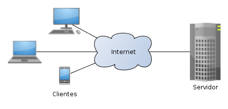

# [Bootcamp Web Developer Full Stack](https://www.thebridge.tech/bootcamps/bootcamp-fullstack-developer/)

### HTML, CSS,  JS, ES6, Node.js, Frontend, Backend, Express, React, MERN, testing, DevOps

# Arquitectura Cliente - Servidor

La arquitectura cliente-servidor es un modelo de diseño de software en el que las tareas se reparten entre los proveedores de recursos o servicios, llamados servidores, y los demandantes, llamados clientes. Un cliente realiza peticiones a otro programa, el servidor, quien le da respuesta. 

Algunos ejemplos de aplicaciones que usen el modelo cliente-servidor son el **Correo electrónico** o cualquier aplicación en Internet que se ejecute en un navegador como cliente.

**En esta arquitectura la capacidad de proceso está repartida entre los clientes y los servidores, aunque son más importantes las ventajas de tipo organizativo debidas a la centralización de la gestión de la información y la separación de responsabilidades, lo que facilita y clarifica el diseño del sistema.**

**La separación entre cliente y servidor es una separación de tipo lógico, donde el servidor no se ejecuta necesariamente sobre una sola máquina ni es necesariamente un solo programa. Los tipos específicos de servidores incluyen los servidores web, los servidores de archivo, los servidores del correo, etc. Mientras que sus propósitos varían de unos servicios a otros, la arquitectura básica seguirá siendo la misma.**

Una disposición muy común son los sistemas multicapa en los que el servidor se descompone en diferentes programas que pueden ser ejecutados por diferentes computadoras aumentando así el grado de distribución del sistema (Ejemplo: Un servidor de BD y otro web dentro de la misma aplicación)

## Características
En la arquitectura C/S el remitente de una solicitud es conocido como cliente. Sus características son:

- Es quien inicia solicitudes o peticiones, tiene por tanto un papel activo en la comunicación (dispositivo maestro).

- Espera y recibe las respuestas del servidor.

- Por lo general, puede conectarse a varios servidores a la vez.

- Normalmente interactúa directamente con los usuarios finales mediante una interfaz gráfica de usuario.

- Al receptor de la solicitud enviada por el cliente se le conoce como servidor. 

Sus características son:

- Al iniciarse espera a que lleguen las solicitudes de los clientes, desempeña entonces un papel pasivo en la comunicación (dispositivo esclavo).

- Tras la recepción de una solicitud, la procesa y luego envía la respuesta al cliente.

- Por lo general, acepta las conexiones de un gran número de clientes (en ciertos casos el número máximo de peticiones puede estar limitado).

En la arquitectura C/S las características generales son:

- El Cliente y el Servidor pueden actuar como una sola entidad y también pueden actuar como entidades separadas, realizando actividades o tareas independientes.

- Las funciones de Cliente y Servidor pueden estar en plataformas separadas, o en la misma plataforma.

