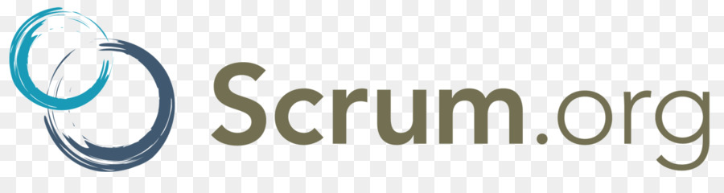

# [Bootcamp Web Developer Full Stack](https://www.thebridge.tech/bootcamps/bootcamp-fullstack-developer/)

### HTML, CSS,  JS, ES6, Node.js, Frontend, Backend, Express, React, MERN, testing, DevOps

# SCRUM

Se trata de una metodología ágil.

## Metologías ágiles

Las metodologías ágiles surgieron en origen como una forma de creación de software. Sin embargo, los mismos principios que regían esta metodología se aplicaron más tarde al mundo empresarial, lo que permitió usarlas en el diseño de productos hoy en día.

Buscan la “agilidad”. Se trata de una metodología de trabajo enfocada a aumentar la productividad y los beneficios de las empresas a través de la implementación de la protocolos que permiten agilizar los procesos. Es decir, aumentar la rapidez en que se solucionan las actividades, pero haciéndolo al mismo tiempo que los resultados aportan calidad a los productos y respuestas a los clientes. 

En 2001 se creó un "Manifiesto Ágil" que incluye los siguiente puntos cuatro puntos que en líneas generales constituyen la base de esta filosofía de trabajo: 

1. Las personas y las interacciones son la prioridad, incluso por delante de los procesos y herramientas. 
2. Que el producto funcione de forma perfecta es más importante que contar con una documentación extensa. 
3. La colaboración con el cliente es más beneficiosa que establecer una relación contractual. 
4. El proceso de trabajo debe tener capacidad de responder ante el cambio, y no obcecarse en mantener el statu quo anterior. 

## Nociones de SCRUM 
Se trata de un estándar en la industria de las siguientes principales áreas de aplicación: 

1. Desarrollo Software 
2. Startups
3. Proyectos complejos (como hemos dicho enfocados a desarrollo de producto)
4. Servicios

**Características:**
- Sistema de trabajo en paralelo
- Trabajo en ciclos cortos (sprints de 2/3 semanas máximo)
- Enfoque a resultados: ciclos cortos con un resultado final siempre
- Permite crear productos/servicios que se adaptan a cambios 
- Permite aprovechar el talento de todo el equipo de trabajo

**Modelo en cascada:**
Es un modelo de trabajo o metodología muy usada (casi de forma natural)

Si por ejemplo quisiéramos desarrollar una aplicación web los pasos naturales que seguiríamos serían algo como: 

1. Toma de requisitos
2. Diseño
3. Implementación
4. Pruebas
5. Matenimiento

Estas tareas o fases son independientes entre ellas y sólo podemos pasar a la siguiente cuando hemos acabado la anterior.

Uno de los problemas que tiene que es las tareas o fases paralizan el trabajo. Por ejemplo si tuviéramos un problema en la fase de implementación habría que volver a la etapa de diseño y hasta no haber terminado el rediseño, no podríamos continuar (los desarrolladores tendrían que esperar por el Arquitecto o Ingeniero de Software o el equipo encargado).

De lo anterior podemos deducir los problemas ocasionados para la empresa.

**Conceptos:**
- Sprint: Ciclo corto de desarrollo que siempre da como resultado un producto final.

Etapas: 
1. Planificación
2. Desarrollo
3. Pruebas
4. Revisión

El producto va evolucionando durante el desarrollo por eso los sprints son cortos (para disponer de juego y posibilidad de rectificación)

Se crean productos que funcionan en todo momento, esto es importante (todo el trabajo se plantea de este modo)

## Cuestiones a tener en cuenta para usar SCRUM

1. **Eficiencia:**
- Todos trabajan en paralelo (producto viable siempre)
- Comunicación constante del equipo
- Todos los roles son intercambiables, no hay jeraquía

2. **Mejora constante:**
- Como los sprints son cortos si fallamos lo hacemos rápido y con poco impacto para el negocio

3. **Adaptación a los cambios:**
- Lo mismo que sucede con la mejora constante, tenemos juego para adaptarnos a los cambios del mercado por ejemplo (Ej: cambiar el planteamiento de una parte de la aplicación)

4. **Maduración del producto:**
- Al tener siempre un producto viable y estar en continuo proceso de prueba el producto se va haciendo estable y robusto en el proceso.

## Roles 
Los roles son importantes porque cada rol tiene sus tareas dentro de los procesos.

1. **Product Owner:**
- No pierde de vista el producto final y vela por él.
- Puede ser el cliente, emprendedor, contacto con el cliente en una empresa grande.
- Se encarga de dar las ideas para generar el producto
- Voz del cliente y del producto
- No es el jefe, puede ser parte del equipo.

2. **Scrum Master:**
Eje fundamental en el equipo, responsable de coordinar y facilitar todos los requerimientos del sprint.

Tareas fundamentales: 
- **Mantener el flujo de trabajo:** Mantener la productividad y la comunicación.
- **Apoyar al equipo:** Senior en todas las áreas
- **Mantener los procesos:** Mantener roles, que cada uno haga lo que tiene que hacer  

3. **Equipo:**
Características: 

- Su trabajo es implementar (crear) el producto.
- Los roles dentro no están cerrados (en un sprint puedes hacer labores de BD y en el siguiente de Front)
- La idea es cumplir los objetivos, esta es su misión más importante
- Mínimo 3/5 personas, máximo 15 para poder mantener los flujos de trabajo y comunicación (no pueden ser muy grandes y debem ser autosuficientes, disponer de todos los perfiles necesarios para los sprints)
- Todos centrados en producir el producto. Enfocados a resultados
- Todos parte del proceso creativo
- Recibe del Scrum Master las instrucciones y cada uno elige tareas
- Todos tienen el mismo rango (filosofía horizontal)

## ¿Cómo es el trabajo?
El proceso es el siguiente

1. **Definición de la bitácora (backlog):**  Lista de todas las necesidades del producto
2. **Elección de tareas a realizar:** Por parte del Scrum Master y el equipo
3. **Asignación de tareas**
4. **Trabajo sobre el sprint**
5. **Presentación del trabajo**
6. **El Product Owner hacer cambios en la bitácora**
7. **Se vuelve a trabajar ahora ya con el producto desarrollado:** Volvemos al paso 1

## Bitácora (backlog)
Plano general del producto sin especificaciones técnicas y siempre desde el punto de vista del usuario.

Es algo como "el usuario debe poder..." (Ej: El usuario debe poder pinchar en un botón de login...)

- Solo el Product Owner puede modificarla.
- Genera un plan de trabajo
- Se debe revisar
- Cada sprint sacar las tareas de ella y cuando se termina se incluyen o cambian

## Scrum diario
Reunión diaria de 15 minutos (fijos) y todos de pie (lo importante es producir)

Se hacen las siguientes preguntas a TODOS (para conocer el estado general del proyecto y el avance): 

1. ¿Qué hiciste ayer?
2. ¿Qué vas a hacer hoy?
3. ¿Hay algún obstáculo para realizar las tareas de hoy?

El Scrum Master obtiene información de cómo va el sprint y puede solucionar problemas.

El equipo puede reunirse para lo que necesite al margen de esta reunión.

## Ejecución de tareas
Parte de desarrollo de producto fundamental

## Presentación del producto 
Reunión de todos los implicados para ver lo hecho en el sprint

## Retrospectiva
Análisis del resultado del sprint

## Reinicio
Vuelta a empezar el proceso para el siguiente sprint