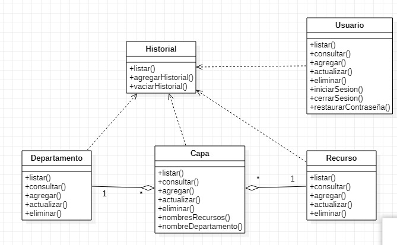
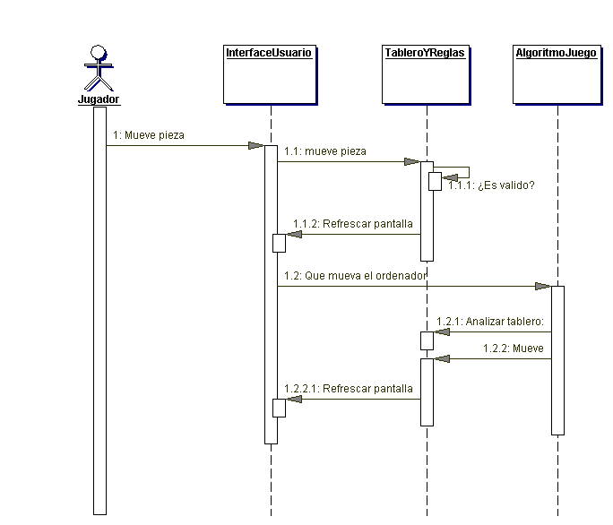

# [Bootcamp Web Developer Full Stack](https://www.thebridge.tech/bootcamps/bootcamp-fullstack-developer/)

### HTML, CSS,  JS, ES6, Node.js, Frontend, Backend, Express, React, MERN, testing, DevOps

# Documentación Básica de un proyecto

Vamos a ver tres ejemplos de tipos de diagramas que documentan un proyecto y nos ayudan en las etapas de diseño.

No debemos olvidar que ya hemos visto el ER en BD Relacionales.

Para los tres el lenguaje que se usa es UML.

Puedes ver información sobre UML aquí:
[UML](https://www.lucidchart.com/pages/es/que-es-el-lenguaje-unificado-de-modelado-uml)

## Casos de uso

Describe las acciones que pueden realizar los usuario, con sus diferentes roles, en la aplicación

## Clases
Define las clases a nivel de proyecto o módulo y la relación que hay entre ellas

[DIAGRAMA_CLASES](https://diagramasuml.com/diagrama-de-clases/)

## Secuencia 
Define el flujo de trabajo en una tarea concreta

