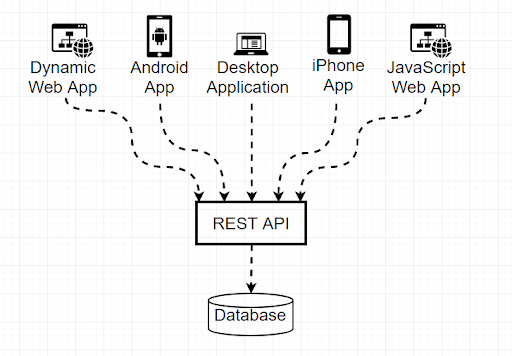

# [Bootcamp Web Developer Full Stack](https://www.thebridge.tech/bootcamps/bootcamp-fullstack-developer/)

### HTML, CSS, JS, ES6, Node.js, Frontend, Backend, Express, React, MERN, testing, DevOps

# API REST


API es un conjunto de reglas y especificaciones que las aplicaciones pueden seguir para comunicarse entre ellas. Para que lo entendamos, el uso de una API es el mecanismo más útil para conectar dos softwares entre sí, de esta manera, podemos garantizar el intercambio de mensajes o datos en formato estándar.

Las operaciones más importantes relacionadas con los datos en cualquier sistema REST y la especificación HTTP son cuatro; POST (crear), GET (leer y consultar), PUT (editar) y DELETE (borrar).

Rest, que es la abreviación de Representational State Transfer, es un conjunto de restricciones que se utilizan para que las solicitudes HTTP cumplan con las directrices definidas en la arquitectura.





Veamos un ejemplo sencillo con Node y Express:

```javascript 

    const express = require("express");
    const app = express();

    let respuesta = {
        error: false,
        codigo: 200,
        mensaje: 'Get en /'
    };
    app.get('/', function (req, res) {
        res.send(respuesta);
    });
    app.get('/endpointget', function (req, res) {
        respuesta.mensaje= 'Get en su endpoint';
        res.send(respuesta);
    });
    app.post('/endpointpost', function (req, res) {
        respuesta.mensaje= 'Post en su endpoint';
        res.send(respuesta);
    });
    app.put('/endpointput', function (req, res) {
        respuesta.mensaje= 'Put en su endpoint';
        res.send(respuesta);
    });
    app.delete('/endpointdelete', function (req, res) {
        respuesta.mensaje= 'Delete en su endpoint';
        res.send(respuesta);
    });
    app.listen(3000, () => {
        console.log("El servidor está escuchando en el puerto 3000");
    });

```
### Ejercicio

1. Revisa el ejemplo que hay en el siguiente enlace y explica el código final añadiendo capturas de las peticiones de Postman.

- [Desarrollando-una-sencilla-api-rest-con-nodejs-y-express](https://asfo.medium.com/desarrollando-una-sencilla-api-rest-con-nodejs-y-express-cab0813f7e4b)
