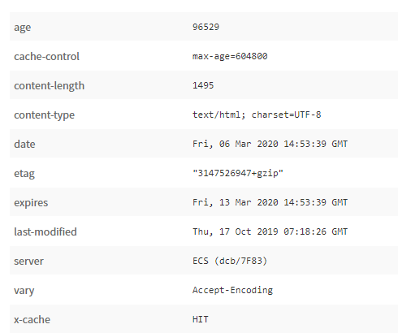
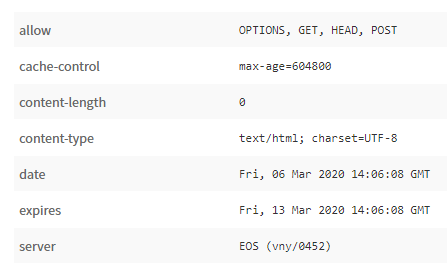

# [Bootcamp Web Developer Full Stack](https://www.thebridge.tech/bootcamps/bootcamp-fullstack-developer/)

### HTML, CSS,  JS, ES6, Node.js, Frontend, Backend, Express, React, MERN, testing, DevOps

# HTTP Peticiones y Respuestas

Hemos hablado del protocolo HTTP, que básicamente se utiliza para permitir transmisión de información en internet, concretamente en la web.

## Peticiones 
Ya hemos visto los tipos de peticiones más comunes, pero vamos a desarrollar estas y algunas más: 

### GET
El método GET  solicita un recurso específico completo (todo el home, toda la página de contacto...etc), son las peticiones que hacemos cuando solicitamos al navegador que se cargue un recurso. Las peticiones que usan el método GET sólo deben recuperar datos.

Se les puede pasar parámetros, pero la información de los mismos pasará a formar parte de la URL y se verá en texto plano, por lo que no es recomendable usar esto con información crítica.

**Ejemplos:**

Debemos tener en cuenta que la configuración del servidor debe incluír ip y puerto del servidor (para nosotros el endpoint básico /, sería localhost:puerto, si nuestra app está publicada se debe apuntar a la ip o nombre configurado en DNS del servidor).

1. Cuando escribes la dirección URL www.ejemplo.com en tu navegador, este se conecta con el servidor web y le envía una petición GET como una de las dos siguientes:

```
    GET /index.html
    GET /

```
2. La petición de la dirección www.ejemplo.com/test.html se formularía de forma análoga:

```
    GET /test.html

```

**Parámetros de URL:**

A la petición GET puede añadirse más información, con la intención de que el servidor web también la procese. Estos llamados parámetros de URL se adjuntan a la dirección URL. La sintaxis es bastante simple:

- La secuencia de petición (query string) se inicia con un signo de interrogación “?”.

- Todos los parámetros se componen de un nombre y un valor: “Nombre=Valor”.

- Si se han de adjuntar varios parámetros, se unen con un signo “&”.

Con un ejemplo se ve mejor: 

3. Veámoslo con este ejemplo: para buscar ciertas ofertas en la página web de una empresa de software, en la petición GET se indicará “Windows” como plataforma y “Office” como categoría:

```

    GET /search?platform=Windows&category=office

```

4. Codificación de caracteres especiales dentro de la URL (Ejemplo el espacio).
Imaginemos que vamos a buscar en nuestra web un tema llamado “Lista HTTP”, en ese caso la codificación de la URL para la petición queda: 

```

    GET /search?thema=Lista%20HTTP

```

[CODIFICACIÓN_CARACTERES_URL](https://www.w3bai.com/es/tags/ref_urlencode.html#:~:text=La%20codificaci%C3%B3n%20URL%20reemplaza%20los,seguido%20de%20dos%20d%C3%ADgitos%20hexadecimales.&text=La%20codificaci%C3%B3n%20URL%20normalmente%20sustituye,(%2B)%20signo%20o%20con%2020%25.)

Veamos un ejemplo con fetch usando la clase [Request](https://developer.mozilla.org/en-US/docs/Web/API/Request/Request), que como podemos ver en el enlace, puede recibir en su configuración muchas opciones.

```javascript

    var myHeaders = new Headers();

    var myInit = { method: 'GET',
                    headers: myHeaders};

    var myRequest = new Request('flowers.jpg', myInit);

    fetch(myRequest)
    .then(function(response) {
        return response.blob();
    })
    .then(function(myBlob) {
        var objectURL = URL.createObjectURL(myBlob);
        var myImage;
        myImage.src = objectURL;
    });

```
Recursos: 

- [Headers](https://developer.mozilla.org/en-US/docs/Web/API/Headers)
- [Request](https://developer.mozilla.org/en-US/docs/Web/API/Request/Request)
- [response.blob](https://developer.mozilla.org/en-US/docs/Web/API/Response/blob)
- [Blob](https://developer.mozilla.org/en-US/docs/Web/API/Blob)
- [URL.createObjectURL](https://developer.mozilla.org/es/docs/Web/API/URL/createObjectURL)

### POST
Se utiliza para enviar una entidad a un recurso en específico, causando a menudo un cambio en el estado o efectos secundarios en el servidor.

La información que se envía va encriptada y está pensado para que enviemos mayor volumen de datos.

Algunos ejemplos de los cambios más comunes que se producen en el servidor o en el estado de la aplicación usando POST, pueden ser: 

- Pasar de no estar autenticado en una aplicación a estarlo
- Registrar a un usuario

Estos dos ejemplos son los más comunes de uso de este tipo de peticiones (hay que recordar que los form llevan method="POST" y un botón de tipo submit)

**Ejemplo de petición POST usando fetch:**

```javascript 

    var url = 'https://example.com/profile';
    var data = {username: 'example'};

    fetch(url, {
        method: 'POST', // or 'PUT'
        body: JSON.stringify(data), // data can be `string` or {object}!
        headers:{
            'Content-Type': 'application/json'
        }
    })
    .then(res => res.json())
    .catch(error => console.error('Error:', error))
    .then(response => console.log('Success:', response));

```

### PUT

La petición HTTP PUT crea un nuevo elemento o reemplaza una representación del elemento de destino con los datos de la petición.

La diferencia entre el método PUT y el método POST es que PUT es un método idempotente: llamarlo una o más veces de forma sucesiva tiene el mismo efecto (sin efectos secundarios), mientras que una sucesión de peticiones POST idénticas pueden tener efectos adicionales, como envíar una orden varias veces.


```javascript
    //Simulacion de envío de datos conm formato Submit 
    var formData = new FormData();
    var fileField = document.querySelector("input[type='file']");

    formData.append('username', 'abc123');
    formData.append('avatar', fileField.files[0]);

    fetch('https://example.com/profile/avatar', {
                method: 'PUT',
                body: formData
                }
    )
    .then(response => response.json())
    .catch(error => console.error('Error:', error))
    .then(response => console.log('Success:', response));

```
### DELETE

Peticiones usadas para eliminar recursos

**Ejemplo:**

```
    DELETE /file.html

```

```javascript

        fetch('https://ejemplo.com/posts/1', {
            method: 'DELETE', 
            headers: {
                'Content-Type': 'application/json'
            },
            body: null
        })
        .then(response => {console.log(response)})


```

Veamos ahora, algunos usados en casos más específicos, en los que no vamos a entrar.

### HEAD 
Igual que GET, pero se omite el body del recurso, sólo solicita la cabecera.
Esta alternativa es conveniente por ejemplo cuando se han de transferir archivos muy voluminosos, ya que, con esta petición, el cliente conoce primero el tamaño del archivo para luego poder decidir si acepta recibirlo o no.

**Ejemplo:**

```

    HEAD /downloads/video1.mpeg HTTP/1.0

```

La respuesta sería algo como: 



[DOCUMENTACION_HEADERS_HTTP](https://developer.mozilla.org/es/docs/Web/HTTP/Headers)

### CONNECT

Establece un túnel hacia el servidor identificado por el recurso.

### OPTIONS
Es utilizado para describir las opciones de comunicación para el recurso de destino. Por ejemplo preguntar al servidor los métodos que soporta para hacer peticiones a un recurso concreto.

**Ejemplo:**

```

    OPTIONS /download.php

```

La respuesta sería algo como: 




## Respuestas

El protocolo dispone de códigos de respues que se clasifican según el tipo de respues que queremos dar: 

### 100
Respuestas informativas.

### 200
Respuestas satisfactorias.

### 300
Redirecciones.

### 400
Errores de cliente.

### 500
Errores de servidor.

[CÓDIGOS](https://developer.mozilla.org/es/docs/Web/HTTP/Status)