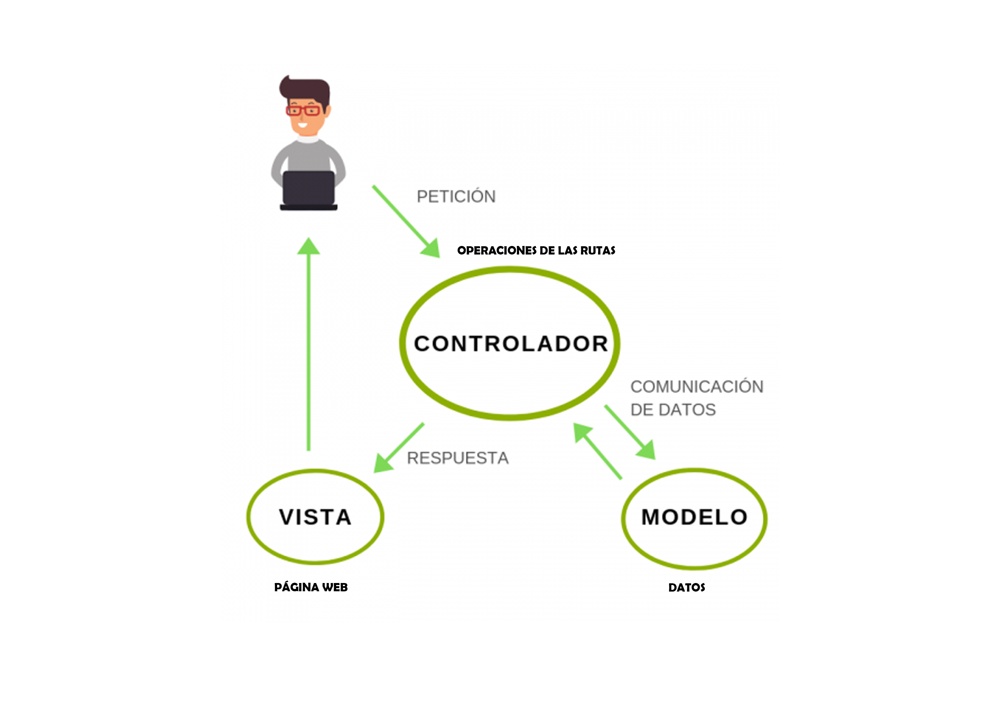

# [Bootcamp Web Developer Full Stack](https://www.thebridge.tech/bootcamps/bootcamp-fullstack-developer/)

### HTML, CSS,  JS, ES6, Node.js, Frontend, Backend, Express, React, MERN, testing, DevOps

# Proyecto MVC (Mongoose, Pug, Express y Node)

Antes de ponernos a realizar el crud , vamos a repasar lo que ya vimos anteriormente, se trata de el patrón de diseño MVC(Modelo,Vista,Controlador)

#MVC


De manera resumida: 

1. El usuario hace una acción sobre la **VISTA** (Ej. Inicia sesión en la web)

2. La **VISTA** envía a el **CONTROLADOR** a través de un endpoint establecido en el controlador (Ej. /login )lo que necesita el mismo para poder mostrarle a el usuario datos

3. El **CONTROLADOR** sabiendo lo que necesita la **VISTA** consulta con el **MODELO** (Base de datos) lo que necesita para llevar a cabo la acción

4. El **CONTROLADOR** recibe los datos que pidió a el **MODELO** y de vuelta envía a la **VISTA** los datos.

5. La **VISTA** muestra a el usuario el resultado.En este caso si el "login" fué correcto mostrará los datos del usuario o que el login fué correcto
 

**Estructura de directorios y ficheros :**

```

    - models
    -------userModels.js
    - views
    -------index.pug
    - database
      -------mongo.js
    - controllers
      -------user.controllers.js
      -------pages.controllers.js
    - routes
      -------routes.js
    - package.json
    - app.js

```

**Instalación de paquetes npm**


1. Instalamos a la vez **mongoose**, **pug** y **express**:

```
npm i pug express pug

```
2. Nuestro package.json debería quedar de la siguiente forma

```javascript
  "dependencies": {
    "express": "^4.17.2",
    "mongoose": "^6.1.10",
    "pug": "^3.0.2"
  }

```

**Creación de carpetas y ficheros**


1. Creamos en la raiz de nuestra aplicación el archivo que tiene toda la configuración de nuestro server , el archivo **app.js**


```
    - app.js
```

2. El archivo  **app.js**

```javascript
  
require("./database/mongo")
const express = require("express");
const app = express();
const router = require("./routes/routes")
const PORT = 3000;
 
app.set("view engine", "pug");
app.set("views", "./views");
 
app.use(express.urlencoded({extended: true}));
app.use(express.json());

app.use("/", router);

app.listen(PORT, ()=>{
    console.log(`Se inicia el server en  http://localhost:${PORT}`);
})


```


3. Creamos la carpeta **views** y su fichero  **index.pug**

```
    - views
    -------index.pug
```
4. El archivo **index.pug**

```pug

   head
  link(rel='stylesheet', href="https://cdn.jsdelivr.net/npm/bootstrap@5.1.3/dist/css/bootstrap.min.css", type='text/css'  integrity="sha384-1BmE4kWBq78iYhFldvKuhfTAU6auU8tT94WrHftjDbrCEXSU1oBoqyl2QvZ6jIW3" crossorigin="anonymous")
  title Pug  
  h1 CRUD PUG 
  #container.col
  
    form(action="/registeruser", method="post"  ) 
      h2 Crear Usuario
      label Inserte Nombre 
      input(type="text" name="firstName"  )
      br
      label Inserte Apellido 
      input(type="text" name="lastName")
      br
      label Inserte URL de Linkedin 
      input(type="text" name="linkedin")
      br
      button(type="submit") Enviar
      
```

5. Creamos la carpeta **controllers** y sus ficheros **pages.controllers.js** y **user.controllers.js**


```
- controllers
      -------user.controllers.js
      -------pages.controllers.js
```

6. El archivo  **pages.controllers.js**

```javascript
const pages = {
  home: (req, res) => {
    res.render("index");
  },
};

module.exports = pages;


```

7. El archivo  **user.controllers.js**

```javascript

const mongoose = require("mongoose");
const UserModel = require("../models/userModels");
const user = {
  registerUser: (req, res) => {
    const { firstName, lastName, linkedin } = req.body;

    let davinia = {
      _id: new mongoose.Types.ObjectId(),
      name: {
        firstName,
        lastName,
      },
      created: Date.now(),
      linkedin,
    };

    let userDavinia = new UserModel(davinia);

    userDavinia.save(function (err) {
      if (err) throw err;
      console.log("Inserción correcta");
      mongoose.disconnect();
    });

    res.render("index");
  },
  updateUser: (req, res) => {
    console.log("updateUser");

    res.render("index");
  },
  deleteUser: (req, res) => {
    console.log("deleteUser");

    res.render("index");
  },
};

module.exports = user;


```


8. Creamos la carpeta **database** y su fichero con la conexión de la bbdd **mongo.js**


```
  - database
      -------mongo.js
```

9. El archivo  **mongo.js**

```javascript
 
const mongoose = require("mongoose");
 
const connectionS = `mongodb://localhost:27017/test`;
 
mongoose
  .connect(connectionS, {
    useNewUrlParser: true,
    useUnifiedTopology: true,
  })
  .then(() => {
    console.log("Base de datos de Mongo conectada");
  })
  .catch((err) => {
    console.error(err);
  });


```

 


10. Creamos la carpeta **models** y su fichero   **userModels.js**


```
  - models
      -------userModels.js
```

11. El archivo  **userModels.js**

```javascript
 
const mongoose = require("mongoose");
const Schema = mongoose.Schema;
 
let userSchema= new Schema({
  
    name: {
        firstName: String,
        lastName: String
    }, 
    created: Date, 
    linkedin: {
        type: String,
        validate: {
            validator: function(urlLinkedin){
                return urlLinkedin.indexOf('https://www.linkedin.com/') == 0;
            }, 
            message: "Linkedin Incorrecto"
        }
    }

  
});
 
const usersModel = mongoose.model("users", userSchema);
module.exports = usersModel;

 

```

 


12. Creamos la carpeta **routes** y su fichero   **routes.js**


```
  - routes
      -------routes.js
```

13. El archivo  **routes.js**

```javascript
const router = require("express").Router();
const pages = require("../controllers/pages.controllers")
const user = require("../controllers/user.controllers")
 

//Rutas de inicio
router.get("/",pages.home);
router.post("/registeruser",user.registerUser);
router.put("/updateuser",user.updateUser);
 

 

module.exports = router;

```


 

[REPOSITORIO PROYECTO](https://github.com/igonzaleztb/CRUDPUG.git)

[RUTAS_ESTATICAS_EXPRESS](https://expressjs.com/es/starter/static-files.html)