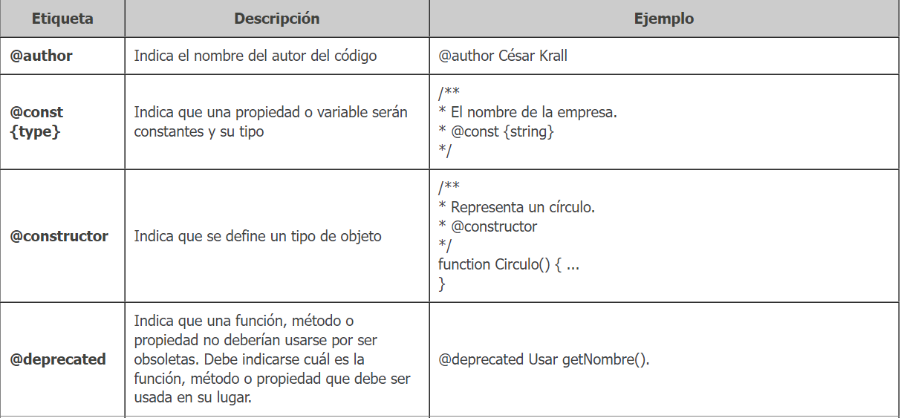
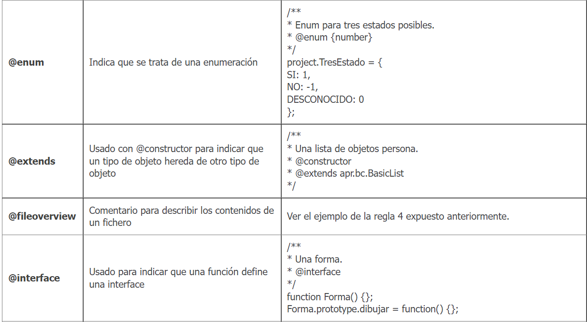
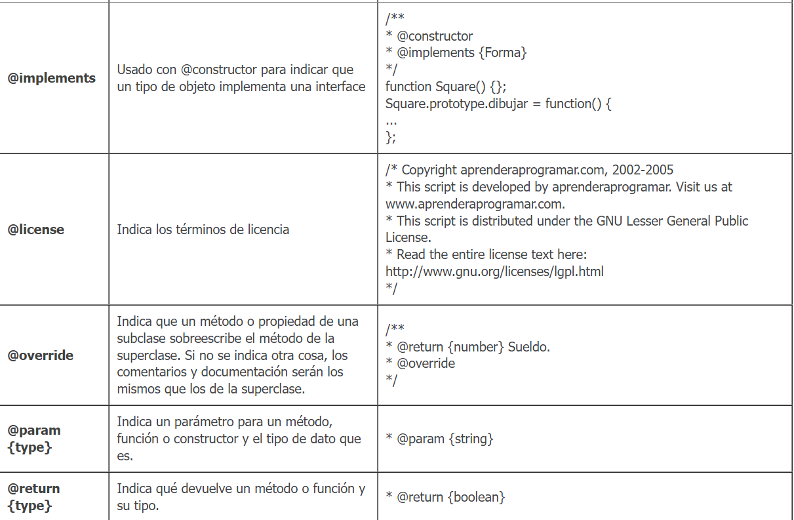
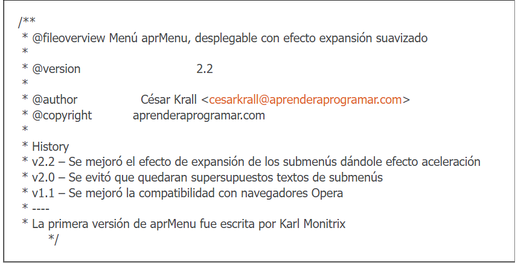
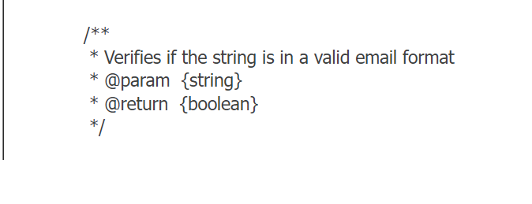
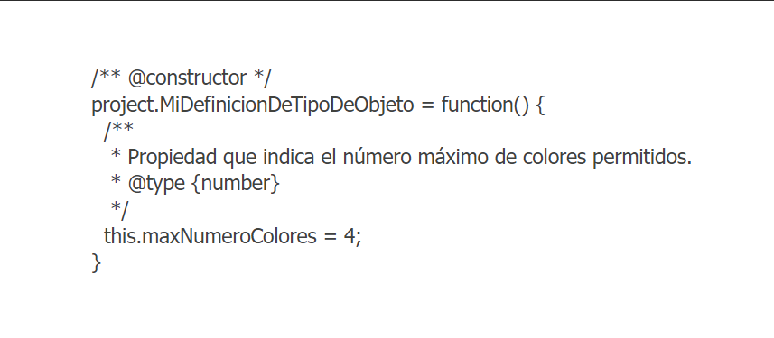

# [Bootcamp Web Developer Full Stack](https://www.thebridge.tech/bootcamps/bootcamp-fullstack-developer/)

### HTML, CSS, JS, ES6, Node.js, Frontend, Backend, Express, React, MERN, testing, DevOps

# JSDOC 


Se trata de una serie de reglas que permiten al paquete que instalamos en Node (jsdoc) generar una documentación web con un formato característico.

En definitiva se trata de documentar siguiendo unas reglas básicas para que podamos disponer de una documentación técnica de calidad.

Antes de comenzar a ver JSDOC, recordemos que lo primero que debemos usar es un naming correcto dentro de nuestro código, estructurarlo de manera correcta y comentar las secciones críticas. Esto no debe cambiar ni disminuir porque dispongamos de JSDOC y vayamos a generar la documentación que nos permite, ya que leer el propio código de forma sencilla es importante para poder trabajar con él.

Veamos las reglas básicas y un ejemplo: 

## Reglas

### Comentarios de bloque siempre
Debemos usar siempre comentarios de bloque y con la siguiente sintáxis: 

```javascript 

    /**
     * Siempre debemos empezar los comentarios de JSDOC con "barra y dos asteriscos" 
    */

```

### Etiquetas

Las etiquetas permiten, dentro de los comentarios, identificar elementos, veamos una tabla: 






### Ejemplo de cabecera



### Ejemplo función



### Ejemplo clase 



### Ejemplo propio

Ahora vamos a desarrollar nuestro ejemplo, veamos los pasos.

1. Crea un nuevo proyecto node y un js con el siguiente código (ubicado dentro de un directorio src): 

```javascript

    /**
     * Represents a book.
     * @constructor
     * @param {string} title - The title of the book.
     * @param {string} author - The author of the book.
     */
    function Book(title, author) {
        return "Title:"+title+" Author: "+author;
    }

```

2. Crea un paquete npm con **npm init -y**

3. Crea un json con el siguiente nombre y contenido: 

**jsdoc.json:**

```javascript

{
    "plugins": [],
    "source": {
        "include": ["src"], //Directorio/s con el código a generar documentación
        "includePattern": ".js$", //Extensiones permitidas
        "excludePattern": "(node_modules|docs)" //Exclusiones
    },
    "templates": {
        "cleverLinks": false,
        "monospaceLinks": false
    },
    "opts": {
        "recurse": true, //Análisis recursivo de archivos (si importamos por ejemplo)
        "destination": "./docs", //Directorio para almacenar la documentación
        "template": ""
    }
}

```

4. Añade a package.json, en la clave "scripts", la siguiente línea: 

```javascript 

    "doc": "jsdoc -c jsdoc.json"

```

5. Genera la documentación con **npm run doc**

6. Abre con Live Server el index ubicado en el directorio **doc**


[TUTORIAL_EJEMPLOS](https://www.aprenderaprogramar.com/index.php?option=com_content&view=article&id=881:guia-de-estilo-javascript-comentarios-proyectos-jsdoc-param-return-extends-ejemplos-cu01192e&catid=78&Itemid=206)

[DOCUMENTACION_JSDOC](https://jsdoc.app/)