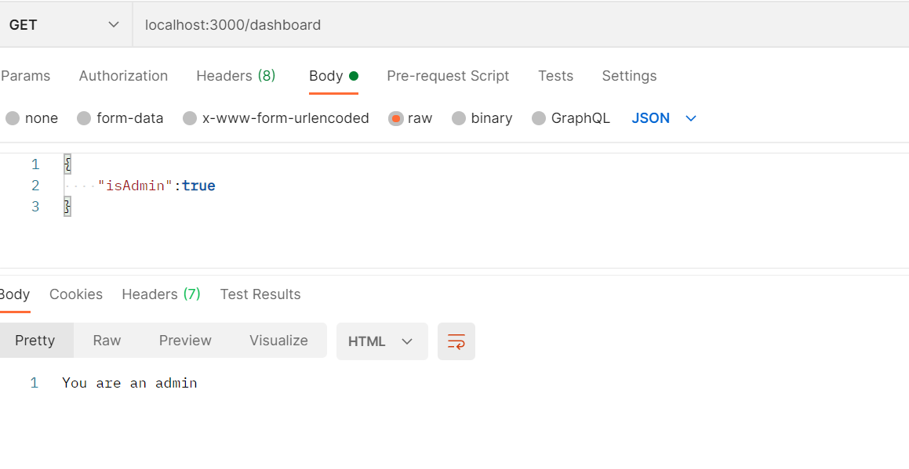
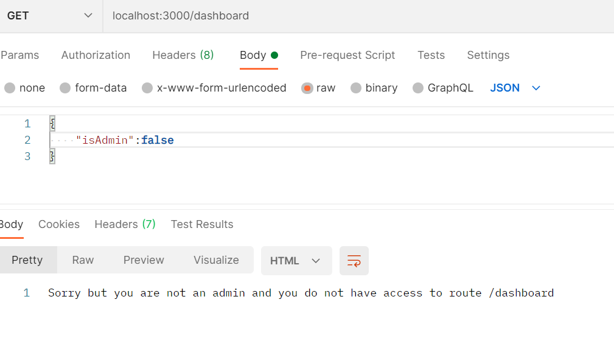

# [Bootcamp Web Developer Full Stack](https://www.thebridge.tech/bootcamps/bootcamp-fullstack-developer/)

### HTML, CSS,  JS, ES6, Node.js, Frontend, Backend, Express, React, MERN, testing, DevOps

# Middlewares

Un middleware es una función que se puede ejecutar antes o después del manejo de un endpoint. Esta función tiene acceso al objeto Request, Response y la función next().

Las funciones middleware suelen ser utilizadas como mecanismo para verificar niveles de acceso antes de entrar en un endpoint, manejo de errores, validación de datos, etc.

Veamos el siguiente ejemplo:

Tenemos definido un endpoint al cual solo usuarios administradores pueden ingresar, por lo tanto, se necesita comprobar antes de entrar a ese endpoint, si el usuario es o no, un administrador. Para ello se enviará un parámetro llamado isAdmin, que puede tener dos valores: true o false. El cual indicará si el usuario es administrador (valor true).

```javascript

    const express = require('express');
    const bodyParser = require('body-parser');
    const app = express();
    const port = 3000;
    var urlencodedParser = bodyParser.urlencoded({ extended: false })

    // Middleware que verifica si el usuario es un administrador.
    function isAdmin(req, res, next) {
        if (req.body.isAdmin) {
            next();
        } else {
            res.status(403).send(`Sorry but you are not an admin and you do not have access to route ${req.url}`);
        }
        console.log("Este es el que sale: "+req.body.isAdmin);
    }

    // Permite recibir parámetros en formato JSON.
    app.use(express.json());

    // Se agrega el middleware en la aplicación.
    app.use(isAdmin);

    // Endpoint al cual solo deben ingresar usuarios administradores.
    app.get('/dashboard', urlencodedParser, (req, res) => {
        console.log(req.body);
        res.send('You are an admin');
    });


    app.listen(port, () => {
        console.log(`Server listeting on port ${port}`)
    }); 

```

## Postman


Vamos a usar esta aplicación que nos permite, entre otras cuestiones, simluar peticiones con varias confiraciones y recibir las respuestas. 

Esto es muy útil para realizar pruebas a aplicaciones propias y de otros proveedores.

[REGISTRO](https://www.postman.com/)

[DESCARGA_LOCAL](https://www.postman.com/downloads/)


### Resultado de las pruebas de nuestro ejemplo.

**isAdmin = true**


**isAdmin = false**


