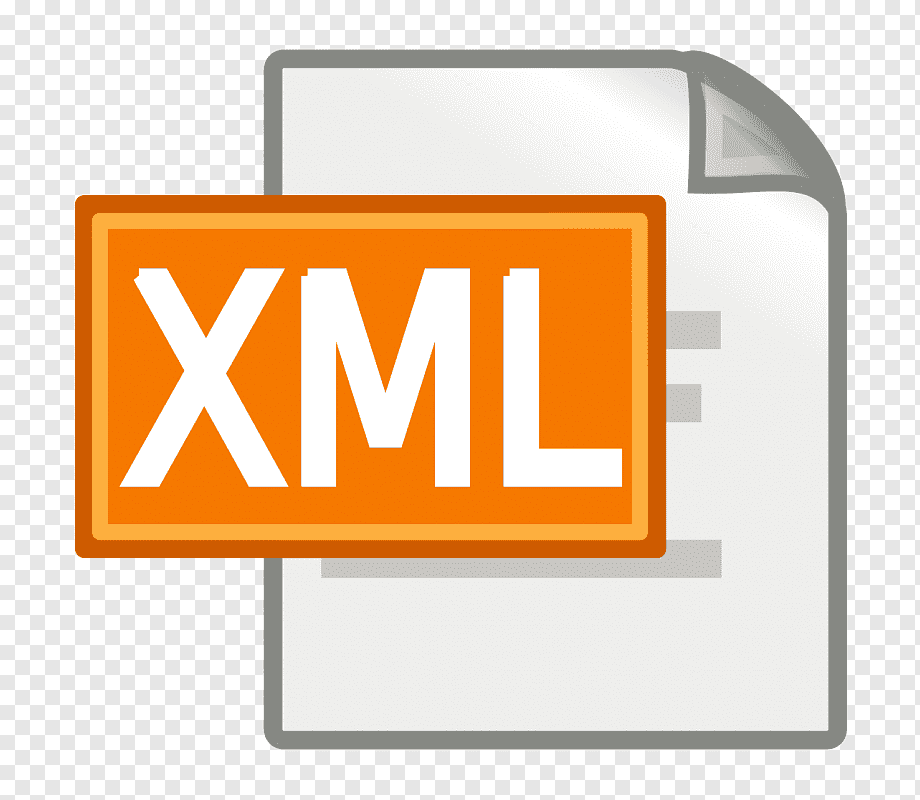

# [Bootcamp Web Developer Full Stack](https://www.thebridge.tech/bootcamps/bootcamp-fullstack-developer/)

### HTML, CSS,  JS, ES6, Node.js, Frontend, Backend, Express, React, MERN, testing, DevOps


# XML 



XML es un metalenguaje de marcas, esto significa que permite crear otros lenguajes de marcas.

Veamos un ejemplo: 

```XML

    <?xml version="1.0" encoding="UTF-8"?>
    <!DOCTYPE cuadros [
    <!ELEMENT cuadros (cuadro*)>
    <!ELEMENT cuadro EMPTY>
    <!ATTLIST cuadro titulo ID #REQUIRED>
    <!ATTLIST cuadro autor CDATA #REQUIRED>
    ]>

    <cuadros>
    <cuadro titulo="Adán y Eva" autor="Alberto Durero" />
    <cuadro autor="Lucas Cranach, el viejo" titulo="Adán y Eva" />
    </cuadros>

```

La primera parte se llama DTD y permite restringir las opciones dentro del XML para luego validarlo.

Esto es útil para poder indicar un formato fijo para los XML y poder usarlos como ficheros de configuración.

XML está cayendo en desuso y siendo sustituido por JSON. 

[INSTRUCCIONES_DTD](https://www.mclibre.org/consultar/xml/lecciones/xml-dtd.html#:~:text=Una%20DTD%20es%20un%20documento,ser%20hijos%20de%20cu%C3%A1les%2C%20etc.)
 
