# [Bootcamp Web Developer Full Stack](https://www.thebridge.tech/bootcamps/bootcamp-fullstack-developer/)

### HTML, CSS,  JS, ES6, Node.js, Frontend, Backend, Express, React, MERN, testing, DevOps

## RAMAS

La funcionalidad de las **ramas** de Git te permite crear nuevas ramas de un proyecto para probar ideas, aislar nuevas características, o experimentar sin impactar al proyecto principal.


Al crear una rama ***branch***, se hace una versión idéntica a la rama origen *(nuestra posición actual)*. Se podrá crear/modificar/quitar código sin dañar la rama ***main***. Es muy importante saber en qué rama nos encontramos, para no llevarnos sustos cuando fusionemos ramas.

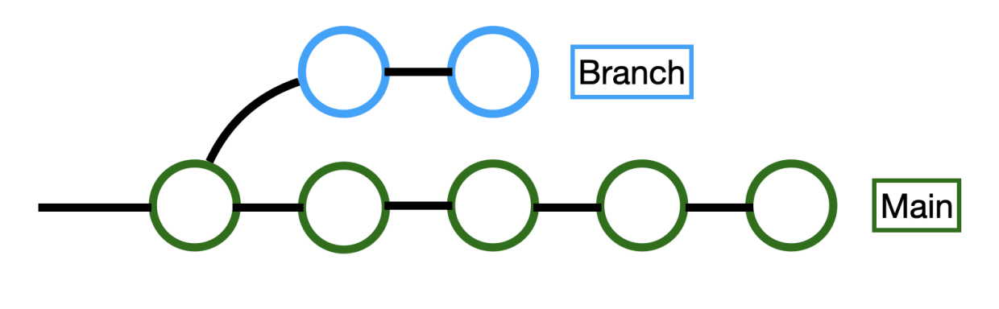

En un proyecto en equipo se reparten tareas, donde cada uno creará sus propias funciones, nav, páginas, backend, frontend, etc. Para incluir los datos actualizados a la rama principal, hay que fusionar (merge) los cambios realizados. Habrá que revisar y comprobar si hay o no conflictos con los códigos de los compañeros.

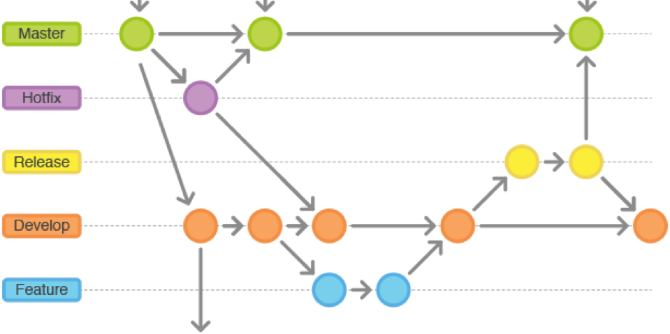

* * * 

# COMANDOS GIT 

### git branch
**Ver** ramas
```git
 git branch 
```


### git branch nombre_de_rama
 
Para **crear** rama desde la rama en la que te encuentras
```git
 git branch nombre_de_rama
```
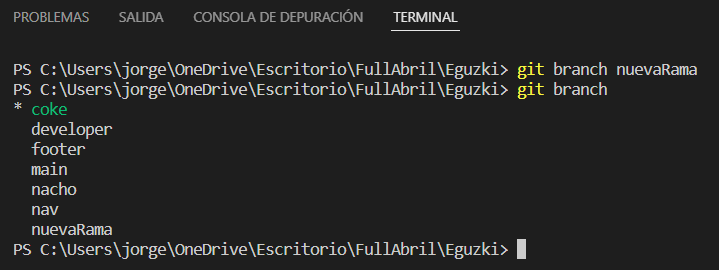
 ### git checkout
Para **cambiar/moverse** a otra rama

```git
 git checkout nombre_de_rama
```
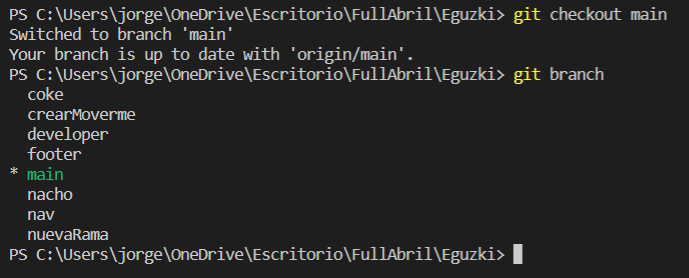

 ### git checkout -b
**Crear y cambiar** de rama 

```git
 git checkout -b nombre_de_rama
```
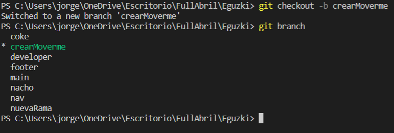

 ### git branch -d
 **Borrar** Rama

 ```git
 git branch -d nombre_de_rama
 ```
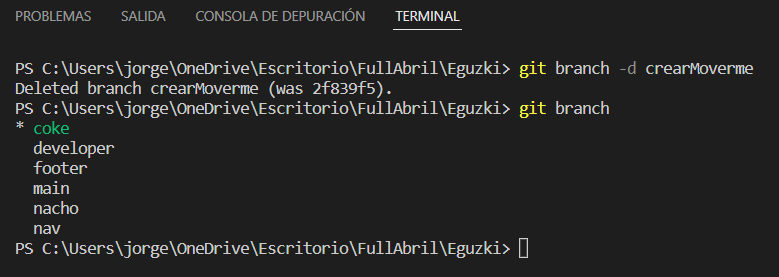
### git log
Ver **commits** 
```git
 git log
```
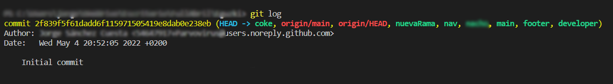


### git status
Ver **cambios/estado** de repositorio local. Se mostrará si se han modificado o no los archivos del repositorio local 
```git
 git status
```
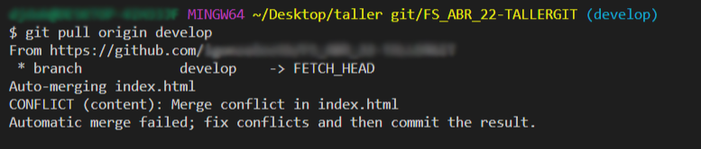
### git commit -m 
**Hacer comentarios** de los cambios
```git
 git commit -m "comentario_en_cuestión"
```
### git push 
 **Subir cambios** a Github
 1. Sube los cambios en local a Github
```git
 git push 
```
2. Sube los cambios en local a Github cuando **no existe** rama previa en Github
 
```git
 git push origin rama_creada_en_local
```
 
  ### git merge
  Sirve para **unir los cambios** de una rama a otra rama. Para ello primero vamos a la rama que va a recibir los nuevos cambios y después decimos de que rama queremos traernos dichos cambios
```git
 git merge rama_secundaria
```


  ### git pull
Descarga los archivos con sus modificaciones originales que se encuentran en el repositorio remoto a local
```git
 git pull
```
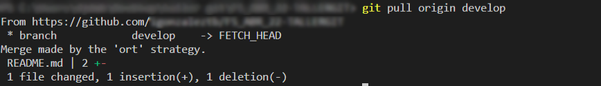

  ### git fetch 
Es el comando que le dice a tu git local que recupere la última información de los metadatos del original (aunque no hace ninguna transferencia de archivos. Es más bien como comprobar si hay algún cambio disponible
1. Puedes usar git fetch para saber los cambios hechos en el repo/rama remoto desde tu último pull. Esto es útil para permitir la comprobación antes de hacer un pull real, lo que podría cambiar los archivos en tu rama actual y en la copia de trabajo (y potencialmente perder tus cambios, etc...)
```git
 git fetch rama_remota
```
* * * 
 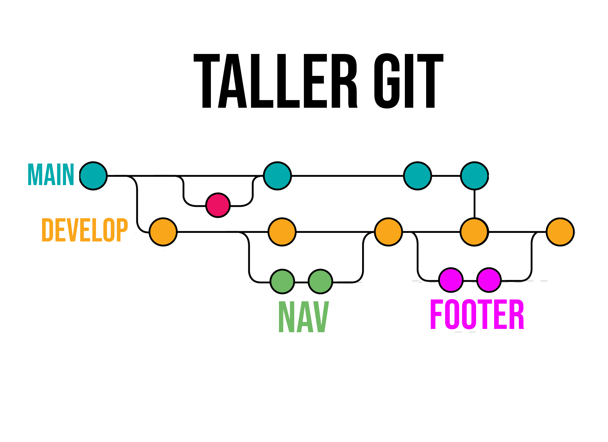

 ***AÑADIR COLABORADOR A TU REPOSITORIO***
 
  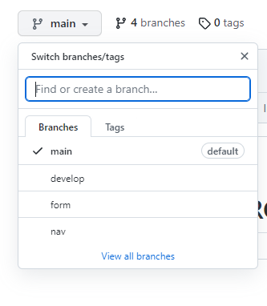

***VISUALIZAR LAS RAMAS QUE CONTIENE NUESTRO REPOSITORIO***

  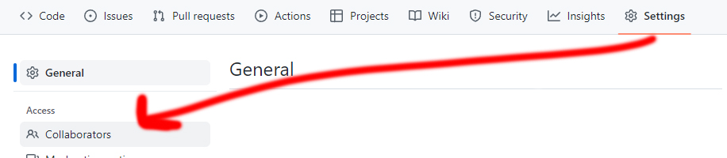
 


***CREAR PULLREQUEST***

 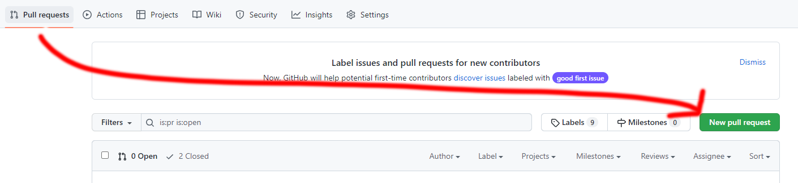


* * * 
***FUSIONAR RAMAS***
  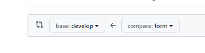


* * * 
## EJERCICIOS

Cogiendo la referencia de la imagen que aparece encima de **Ejercicios** realizar la siguiente actividad junto con tu compañer@.

1. Crea un repositorio con tu compañer@ y añadel@ como colaborador a tu repositorio para que pueda hacer modificaciones en él


 

2. Crear un archivo **index.html** que será el archivo de nuestra estructura base o principal de nuestro proyecto.Todo esto tiene que crearse en la rama de desarrollo que le pondremos de nombre **develop**

```html 
<!DOCTYPE html>
<html lang="en">
<head>
    <meta charset="UTF-8">
    <meta http-equiv="X-UA-Compatible" content="IE=edge">
    <meta name="viewport" content="width=device-width, initial-scale=1.0">
    <title>EJERCICIO RAMAS GIT</title>
</head>
<body>
     <h1>EJERCICIO RAMAS GIT</h1>
</body>
</html>

``` 
3. Hay que crear 2 ramas **nav** y **footer**. Uno de vosotros tiene que crearse la rama **nav** y hacer modificaciones en esa rama y el otro lo mismo con la rama **footer**
4. Añadir estilo css sobre la etiqueta **body**.
Uno de vosotros usar el siguiente estilo :
```css
body{
  background: yellow;
  color :black

}


```
y otro el siguiente estilo :
```css
body{
  background: black;
  color :red

}

```

5. Una vez que hayais agregado los estilos y creado las ramas con sus correspondientes cambios hay que unir estos cambios con la rama de desarrollo **develop**.Una vez concluido y hayais resuelto todos los conflictos que puedan aparecer al unir las ramas descargar en local los cambios de la rama ***develop***.


 
