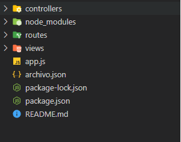
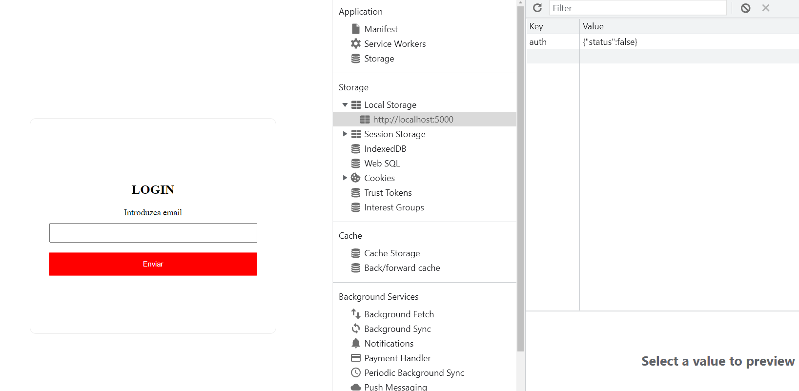
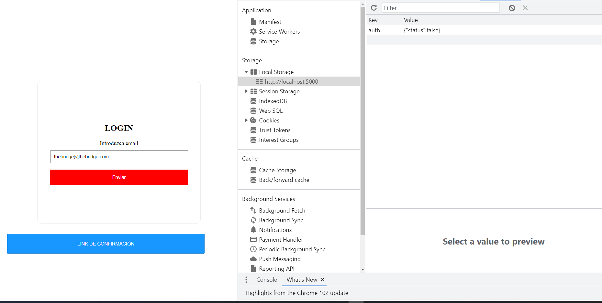
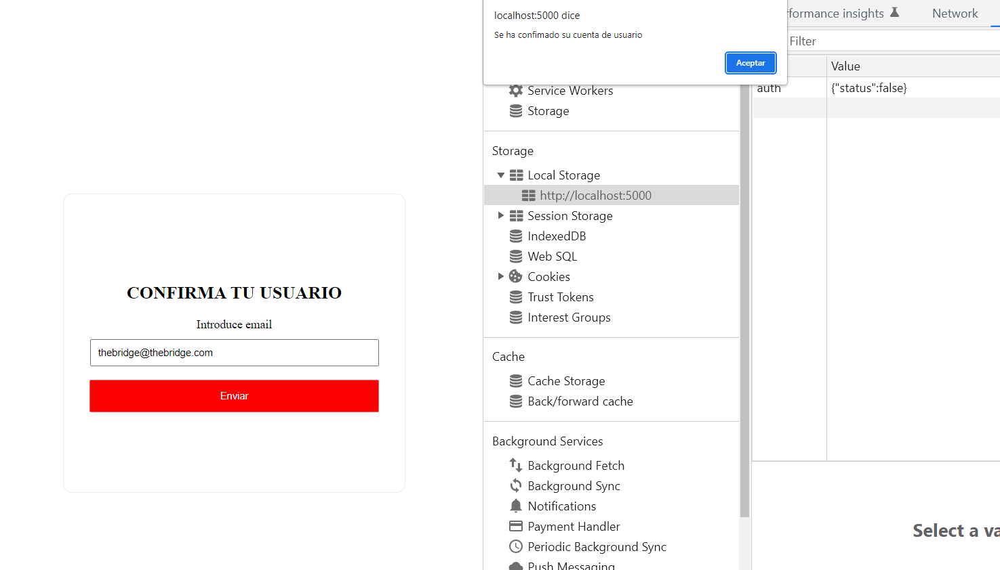
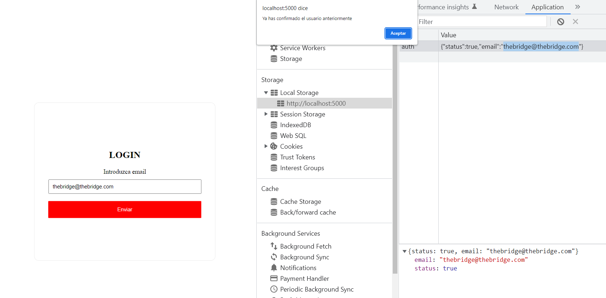

# [Bootcamp Web Developer Full Stack](https://www.thebridge.tech/bootcamps/bootcamp-fullstack-developer/)

### HTML, CSS, JS, ES6, Node.js, Frontend, Backend, Express, React, MERN, testing, DevOps

# Taller Confirmación de Registro Nacho

Vamos a desarrollar una aplicación fullstack con implementación de JWT

La estructura de ficheros será la siguiente



1. Iniciamos un proyecto de **Nodejs**

```
npm init -y
```

2. Instalamos las siguientes dependencias: 

```
npm i express jsonwebtoken nodemon ejs

```
3. Creamos archivo de configuración de nuestro servidor con el nombre **app.js**

4. Dentro de **package.json** colocamos la opción de start:

```js
  "scripts": {
    "test": "echo \"Error: no test specified\" && exit 1",
    "start": "nodemon app.js"
  },
```

5. Pegamos el siguiente contenido dentro de **app.js**

```js

const express = require("express");
const router = require("./routes/routes");
const app = express();

app.use(express.json());
app.set("view engine", "ejs");
 
app.use("/", router);
const port = 5000;
app.listen(port, () => console.log(`Servidor escuchando por el puerto ${port}!`));


```

6. Creamos las siguientes carpetas

```
/routes
/controllers
/views
```

7. Dentro de la carpeta **/routes**  creamos **routes.js** con el siguiente contenido:

```js
const router = require("express").Router();

const user = require("../controllers/user.controllers");


router.get("/",user.home)
router.post("/confirmuser", user.confirmedUser);
router.get("/confirmuser/:id/:token", user.confirmUserGet);
router.post("/confirmuser/:id/:token", user.checkUserPost);
router.get("/datauser", user.dataUser);

module.exports = router;

```

8. Dentro de la carpeta **/controllers**  creamos **user.controllers.js** con el siguiente contenido

```js
 const jwt = require("jsonwebtoken");

const fs = require("fs");

const SECRET = "tallerjwt";

const user = {
    home: (req,res)=>{

        res.render("index");

    },
  confirmedUser: async (req, res) => {
    let emailUser = req.body.email;

    let objectToSave = { status: false, email: "" };
 
    let idUsuario = 1;

     const payload = {
      email: emailUser,
      id: idUsuario,
    };

    const token = jwt.sign(payload, SECRET, { expiresIn: "15m" });

    const link = `http://localhost:5000/confirmuser/${idUsuario}/${token}`;

    let data = {
      link,
    };

    res.json(data);
  },

  checkUserPost: (req, res) => {
    const { email } = req.body;
    let objectToSave = { status: true, email: email };

    fs.writeFile(
      "archivo.json",
      JSON.stringify(objectToSave),
      "utf8",
      (err) => {
        if (err) throw err;
        console.log("Archivo guardado");
      }
    );
  },
  confirmUserGet: async (req, res) => {
    const { token } = req.params;

    try {
      jwt.verify(token, SECRET);

      res.render("confirmed-user");
    } catch (error) {
      res.send("No se puede confirmar el usuario, token inválido");
    }
  },
  dataUser: (req, res) => {
    const json = require("../archivo.json");

    console.log(json)
    if (!json) {
    } else {
      res.json(json);
    }
  },
};

module.exports = user;

```

9. Dentro de la carpeta **/views**  creamos **confirmed-user.ejs** con el siguiente contenido

```HTML
<!DOCTYPE html>
<html lang="en">

<head>
  <meta charset="UTF-8">
  <meta http-equiv="X-UA-Compatible" content="IE=edge">
  <meta name="viewport" content="width=device-width, initial-scale=1.0">
  <title>CONFIRMA TU USUARIO</title>
</head>
<style>

input{
  margin: 2%;
  width: 80%;
  padding: 2%;
  
}
button{
  margin: 2%;

  width: 85%;
  padding: 3%;
  background-color: red;
  border: 1px solid rgb(255, 91, 91);
  color: white;
  border-radius: 2px;
}

section {
  background-color: white;
  text-align: center;
  width: 70%;
  margin-left: 15%;
 margin-top: 40%;
  padding-top: 15%;
  padding-bottom: 15%;
 border-radius: 12px;
 border: 1px solid rgb(236, 236, 236);
 box-shadow: rgb(236, 236, 236)  ;
}


</style>
<body>
 
  <section>
    <h1>CONFIRMA TU USUARIO</h1>
    <label for="">Introduce email</label>
    <br>
    <input type="text" name="email" id="email">
 
  
    <button id="send">Enviar</button>
  

  </section>
 
  <script>

    document.getElementById("send").addEventListener("click", function () {

       let email = document.getElementById("email").value
 

      let paginaActual = window.location.pathname;

      const data = {  
      email: email };


      localStorage.setItem(
        "auth",
        JSON.stringify({
          status: true,
        })
      );

     
      fetch(`${paginaActual}`, {
        method: 'POST',
        headers: {
          'Content-Type': 'application/json',
        },
        body: JSON.stringify(data),
      })

      alert("Se ha confimado su cuenta de usuario ")
      location.href = "http://localhost:5000"


    })
 
  </script>
</body>

</html>

```

 
10. Dentro de la carpeta **/views**  creamos **index.ejs** con el siguiente contenido


```HTML
<!DOCTYPE html>
<html lang="en">

<head>
    <meta charset="UTF-8">
    <meta http-equiv="X-UA-Compatible" content="IE=edge">
    <meta name="viewport" content="width=device-width, initial-scale=1.0">
    <title>Document</title>
    <style>
 input{
  margin: 2%;
  width: 80%;
  padding: 2%;
  
}
a{
    color: white;
    text-decoration: none;
}
.confirmed-link{
  background-color: rgb(23, 151, 255);
  border: 1px solid rgb(0, 113, 206);
}
button{
  margin: 2%;

  width: 85%;
  padding: 3%;
  background-color: red;
  border: 1px solid rgb(255, 91, 91);
  color: white;
  border-radius: 2px;
}

section {
  background-color: white;
  text-align: center;
  width: 70%;
  margin-left: 15%;
 margin-top: 40%;
  padding-top: 15%;
  padding-bottom: 15%;
 border-radius: 12px;
 border: 1px solid rgb(236, 236, 236);
 box-shadow: rgb(236, 236, 236)  ;
}
  
@keyframes slide-in-top{0%{transform:translateY(-1000px);opacity:0}100%{transform:translateY(0);opacity:1}}
.slide-in-top{animation:slide-in-top .5s cubic-bezier(.25,.46,.45,.94) both}@keyframes slide-in-fwd-center{0%{transform:translateZ(-1400px);opacity:0}100%{transform:translateZ(0);opacity:1}}
    </style>
</head>


<body>
    <div className="App">
        <section className="slide-in-top">

            <h1>LOGIN</h1>

            <label htmlFor="">Introduzca email</label>
            <br />
            <input type="text" id="email_confirmation" />
            <br />
            <button id="btn_confirm">Enviar</button>

        </section>
        <p id="paint_link"></p>

    </div>

    <script>

        document.getElementById("btn_confirm").addEventListener("click", () => {

            let email = document.getElementById("email_confirmation").value

            let data = JSON.parse(localStorage.getItem("auth"));

            if (data.status == false) {
                let data = {
                    email,
                };
                fetch("/confirmuser", {
                    method: 'POST',
                    headers: {
                        'Content-Type': 'application/json',
                    },
                    body: JSON.stringify(data),
                }).then(res => res.json()).then(res =>


                    document.getElementById("paint_link").innerHTML = `
                    <button class="confirmed-link">  <a href="${res.link}">LINK DE CONFIRMACIÓN </a> </button>
      
      `

                )
            } else if (data.status == true && data.email == email) {
                alert("Ya has confirmado el usuario anteriormente");
            } else if (
                (data.status == true) | (data.status == true) &&
                data.email !== email
            ) {
                let data = {
                    email,
                };
                fetch("/confirmuser", {
                    method: 'POST',
                    headers: {
                        'Content-Type': 'application/json',
                    },
                    body: JSON.stringify(data),
                }).then(res => res.json()).then(res =>


document.getElementById("paint_link").innerHTML = `
<button class="confirmed-link">  <a href="${res.link}">LINK DE CONFIRMACIÓN </a> </button>

`

)
            }
            else{

                
            }

        })


        async function loadData() {

            let data = JSON.parse(localStorage.getItem("auth"));

            console.log(data)


            await fetch("/datauser").then(res => res.json()).then(petition => {

                console.log(petition)


                if (!data) {
                    localStorage.setItem(
                        "auth",
                        JSON.stringify({
                            status: false,
                        })
                    );
                } else {
                    if (petition.status == true && petition.email !== "") {


                        localStorage.setItem(
                            "auth",
                            JSON.stringify({
                                status: true,
                                email: petition.email,
                            })
                        );
                    } else {
                    }
                }


            });

        }


        loadData()
    </script>
</body>

</html>
```

11. Creamos finalmente un **json** con el nombre **archivo.json** y el siguiente contenido en la raíz de nuestro proyecto.

```json
{"status":true,"email":""}
```


## Capturas de resultado final 




