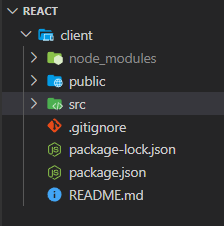
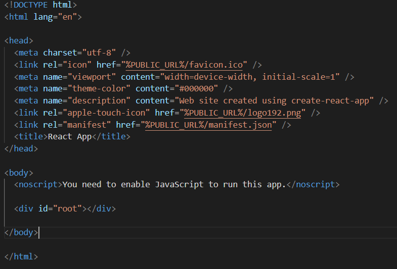
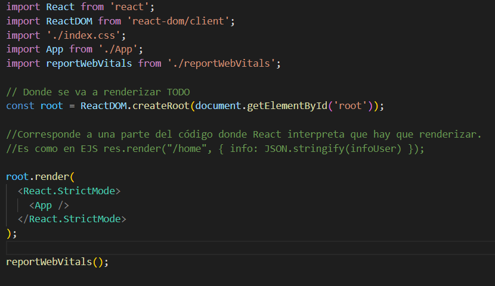
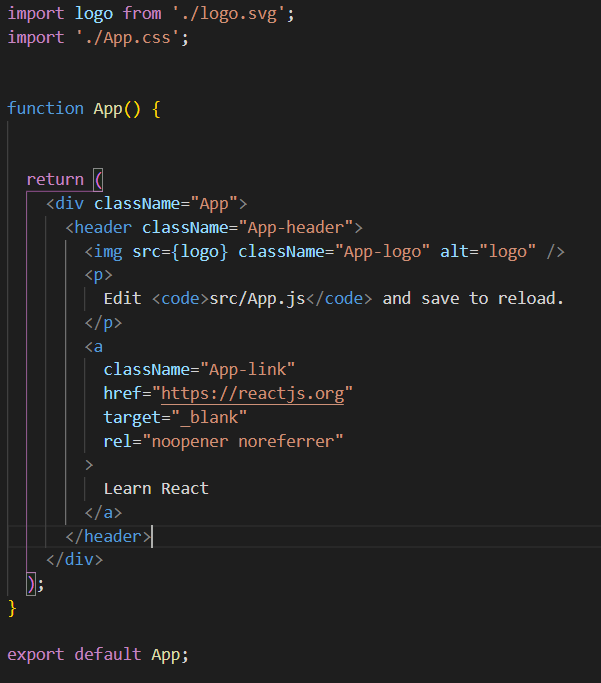
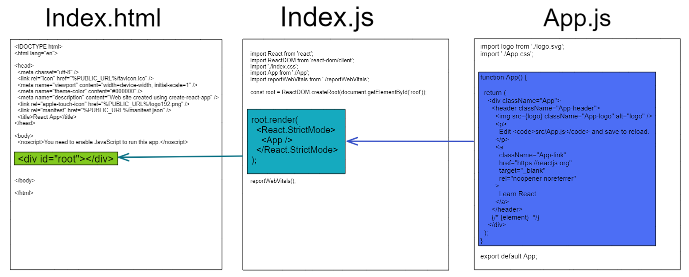
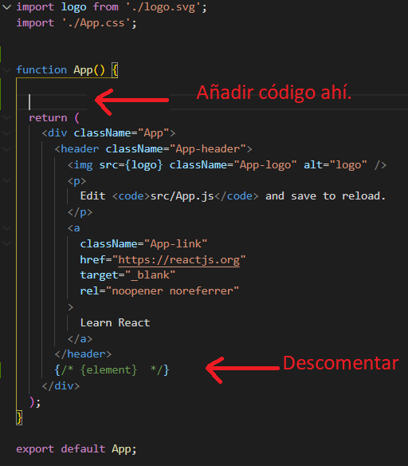

# [Bootcamp Web Developer Full Stack](https://www.thebridge.tech/bootcamps/bootcamp-fullstack-developer/)

### HTML, CSS,  JS, ES6, Node.js, Frontend, Backend, Express, React, MERN, testing, DevOps

# Introducción a React.js


## Objetivos de hoy:

1. **Averiguar por qué** utilizamos React.
2. **Entender** que es JSX y el virtual DOM.
3. **Acercarnos** al nuevo lenguaje.
4. **Controlar** dónde se tiene que añadir el código para que se renderice.

## ¿Qué es React?
 
1. React es una librería de JavaScript de **código abierto**, **eficiente** y **flexible** para construir interfaces de usuario. 

2. Permite componer IUs complejas de pequeñas y aisladas piezas de código llamadas **“componentes”.**

3. Sirve para desarrollar aplicaciones web de una manera más **ordenada** y con **menos código**.

4. Permite que las vistas se **asocien** con los datos, de modo que si cambian los datos, también cambian las vistas de manera "automática".

## ¿Quién lo usa?

```
Facebook, Instagram, Netflix, New York Times, Yahoo, Khan Academy, Whatsapp, Codecademy, Dropbox, Airbnb, Asana, Atlassian, Microsoft...etc
```

## Virtual DOM

El **Virtual DOM** es una representación en memoria del DOM real que actúa de intermediario entre el estado de la aplicación y el DOM de la interfaz gráfica que está viendo el usuario.

El Virtual DOM se basa en una idea bastante sencilla e ingeniosa:

1. Cuando se **actualiza una vista**, React se encargue de actualizar el **DOM Virtual**, que es mucho más rápido que actualizar el DOM del navegador (DOM real). 
   
2. Cuando React **compara** el DOM Virtual con el DOM del navegador **sabe** perfectamente qué partes de la página debe actualizar y se ahorra la necesidad de actualizar la vista entera. 
   


## Instalar React

Vamos a crear nuestra primera aplicación de React, para ello tenemos que:

1. Ir a Code u otro entorno de desarrollo y teclear el siguiente comando en la terminal/consola en la ruta en la que quieras crear tu proyecto React.js

```
    npx create-react-app client
```

## Estructura

Al descargar React, nos añade un conjunto de **carpetas** y **archivos** que son necesarios para que funcione su estructura completa.



1. client: Es la carpeta que contiene todo.

2. public: Se encuentra en otras cosas, **index.html**, que contiene un div donde renderiza todo: 

```html

<div id="root"></ div>

```
3. src: Existen varios archivos, pero los que nos interesan son:

- index.js: Donde renderiza todas las vistas y se las pasa a index.html
- App.js: Es la página o componente ejemplo donde vamos a ir integrando y creando nuesto código Front.
- Otros: index.css y App.css.
  
* Vamos a explicar uno a uno los archivos más relevantes que vamos a utilizar:

### Index.html

Lo que debemos entender de este archivo es que todo se va a renderizar o va a visualizarse por este div raíz: 

```html

<div id="root"></div>

```



*Ejemplo con front (root.html)*

* * *

### Index.js

Las primeras líneas son para importar bibliotecas de React, y archivos como App.js.

```js

import App from './App';

```


* * * 

### App.js

1. Los primeros imports es para un **Logo** y para la hoja de **estilos css**.
2. Dentro de la función **App** se encuentra el return que React va entender donde se va a colocar el lenguaje Jsx para que se visualice su contenido.
3. La línea final es para exportar App.
4. **¡IMPORTANTE!** Después de estos return tiene que haber un **inicio y cierre** de div.




### Esquema:





### Arrancar React

1º. Vamos a arrancar React recordando que tenemos que estar en la carpeta 
***client***.

```
 npm start
```


2º. Ahora nos iremos al fichero **App.js** que está dentro de la carpeta **src**


Este es el código:

```javascript

import logo from './logo.svg';
import './App.css';

function App() {
  return (
    <div className="App">
      <header className="App-header">
        
        <p>
          Edit <code>src/App.js</code> and save to reload.
        </p>
        <a
          className="App-link"
          href="https://reactjs.org"
          target="_blank"
          rel="noopener noreferrer"
        >
          Learn React
        </a>
      </header>
    </div>
  );
}

export default App;

```

1. Eliminaremos/comentaremos la img y vemos que pasa.
   
2. Eliminaremos/comentaremos las siguientes lineas quedando el código de la siguiente manera:

```javascript
import './img/App.css';

function App() {
  return (
    <div className="App">
     
    </div>
  );
}

export default App;
```

3. Ahora agregaremos unos **h1,h2,h3 y h4**.


```js
import './App.css';

function App() {
  return (
    <div className="App">
      <h1>REACT</h1>
      <h2>JSX</h2>
      <h3>VIRTUAL DOM</h3>
      <h4>HOLA MUNDO</h4>
    </div>
  );
}
export default App;
```
3º  Ahora nos iremos al fichero **index.js** 

 ```js
 import React from 'react';
import ReactDOM from 'react-dom/client';
import './index.css';
import App from './App';
import reportWebVitals from './reportWebVitals';

const root = ReactDOM.createRoot(document.getElementById('root'));

root.render(
  <React.StrictMode>
    <App />
  </React.StrictMode>
);

reportWebVitals();

 ```
1. Copiaremos < App/> y la pegamos debajo de ella, y vemos que pasa.

2. Pondremos: 

```html
 <h1>Hola</h1>
``` 

encima de  < App/>, y vemos que pasa.

3. **¡Consejo!** Normalmente no se introduce etiquetas o código extenso en el render de index.js, solo las vistas o componentes importadas.

* * * 

## JSX (JavaScript XML)

1. Es una **extensión** de JavaScript que nos permite mezclar **JS** y **XML**.
2. Esta extensión nos facilita la vida pues nos permite escribir un **código más limpio**.
3. Vamos a **utilizar** este lenguaje al usar y renderizar en React.


**Primer ejemplo**

```javascript 
// Declaramos una variable llamada name y luego la usamos dentro del JSX envolviéndola dentro de llaves.
    const name = 'Josh Perez';
    const element = <h1>Hello, {name}</h1>;
```
**Segundo ejemplo**
```javascript

// Insertamos el resultado de llamar la función de JavaScript, formatName(user), dentro de un elemento h1
    function formatName(user) {
        return user.firstName + ' ' + user.lastName;
    }

    const user = {
        firstName: 'Harper',
        lastName: 'Perez'
    };

    const element = (
    <h1>
        Hello, {formatName(user)}!
    </h1>
    );
```
 ## Ver el resultado

 Para ver cómo cambia en React se le pone el código encima del return y se descomenta o se crea {element}. 
 Lo importante de esta teoría es manejar el lenguaje JSX y saber dónde ponerlo, en este caso es en app.js.



- Después de compilarse, las **expresiones JSX** se convierten en llamadas a **funciones JavaScript regulares** y se evalúan en objetos JavaScript.

- Esto significa que puedes usar **JSX** dentro de declaraciones if y bucles for, asignarlo a variables, aceptarlo como argumento, y retornarlo desde dentro de funciones:

```javascript 

    function getGreeting(user) {
        if (user) {
            return <h1>Hello, {formatName(user)}!</h1>;
        }
        return <h1>Hello, Stranger.</h1>;
    }

```

- Puedes utilizar comillas para especificar strings literales como atributos:

```javascript 

    const element = <a href="https://www.reactjs.org"> link </a>;

```

- También puedes usar llaves para insertar una expresión JavaScript en un atributo:

```javascript 

    const element = </img>;

```
- Etiquetas vacías: 

```javascript 

    const element = ;

```

- Las etiquetas de Javascript pueden contener hijos:

```javascript 

    const element = (
        <div>
            <h1>Hello!</h1>
            <h2>Good to see you here.</h2>
        </div>
    );

```

En la documentación de React.js puedes encontrar más ejemplos: 

[DOCUMENTACION_REACT](https://es.reactjs.org/)

 
[REPOSITORIO PROYECTO](https://github.com/igonzaleztb/holamundo-react)
