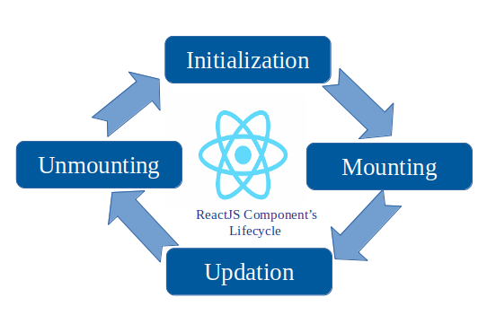

# [Bootcamp Web Developer Full Stack](https://www.thebridge.tech/bootcamps/bootcamp-fullstack-developer/)

### HTML, CSS,  JS, ES6, Node.js, Frontend, Backend, Express, React, MERN, testing, DevOps

# Componentes 1

## Definición
Los componentes de React son elementos autónomos, es decir que tienen sentido por sí mismos, que puede reutilizar en una página, hablando siempre del Front. Al crear pequeñas piezas de código centradas, las puede mover y reutilizar a medida que su aplicación se amplía. 

La clave es que son independientes, lo que le permite separar el código en piezas lógicas y componer unas con otras.

Por ejemplo: Para crear un componente Tabla, podríamos crear un componente Cabecera para los títulos y otro Cuerpo para los datos.

## Ciclo de vida del componente

En React los componentes son de clase o funcionales, en este caso vamos a trabajar con los componentes de clase.

El ciclo de vida de los componentes es lo que permite a Ract.js trabajando con el virtual DOM interactuar con partes que queremos renderizar y con el DOM de manera eficiente.

Disponemos de 3 fases diferenciadas en el ciclo de vida: 

1. Montado 
2. Actualización 
3. Desmontado



## Props

Objetos que los componentes reciben de manera desatendida y gracias a React y permiten por medio de atributos en nuestras etiquetas JSX, comunicarnos con los componentes. 

Veamos el siguiente ejemplo: 

- Imaginemos que disponemos de un componente HolaMundo, si tuviéramos el siguiente código JSX: 

```javascript

<HolaMundo titulo="Hola Mundo" finalidad="Primer Ejemplo props"/>

```

Lo que se almacenaría en las props del componente HolaMundo de forma automática sería: 

```javascript 
  
  props.titulo = "Hola Mundo"
  props.finalidad = "Primer Ejemplo props"

```

Esto nos permite comunicarnos de una manera sencilla con los componentes y tiene una considerable utilidad.

## State

El estado es muy importante en React, porque si se producen cambios en el estado se producen renderizados usando Virtual DOM de los componentes. 

Cuando se hace un cambio en un estado el componente pasa por la fase de actualización del ciclo de vida y como hemos visto, gracias al Virtual DOM de React.js sólo se vuelve a renderizar la parte indispensable del componente y luego se escribe en el DOM.

Vamos a ver cómo usar tanto estados como props en nuestros componentes de clase.

## Componentes de clase

Una manera de definir nuestros propios componentes es usar clases de POO como las hemos visto.

Cuando definimos un componente de clase en React, el único método que estamos obligados a implementar es el método render(). 

Veamos un ejemplo: El componente Welcome

```javascript

import React from 'react';

class Welcome extends React.Component {
    render() {
        return <h1>Hello, {this.props.name}</h1>;
    }
}

export default Welcome;

```

El método render() es el que permite a React y al navegador "pintar" nuestro componente y es obligatorio implementarlo porque React.Component dispone de dicho método abstracto.

Crea el componente Welcome en tu carpeta src y deja el index.js con el siguiente código: 

```javascript

import React from 'react';
import ReactDOM from 'react-dom/client';
import './index.css';

import Welcome from './Welcome';

import reportWebVitals from './reportWebVitals';

const root = ReactDOM.createRoot(document.getElementById('root'));
root.render(
  <React.StrictMode>
    <Welcome name="Davinia"/>
    <Welcome name="Coke"/>
    <Welcome name="Nacho"/>
  </React.StrictMode>
);

// If you want to start measuring performance in your app, pass a function
// to log results (for example: reportWebVitals(console.log))
// or send to an analytics endpoint. Learn more: https://bit.ly/CRA-vitals
reportWebVitals();


```

## Ejemplo Ciclo de vida

Pasos: 

1. Crea tu proyecto de React: 

```

npx create-react-app client

```
2. Accede al directorio client

3. Añade un componente creando en src Clock.js con el siguente código: 

```javascript 

import React from "react";

class Clock extends React.Component {
    constructor(props) {
        super(props);
        this.state = { date: new Date() };
        if(props.ciudad){
            console.log(`Hay contenido en ${props.ciudad}`);    
        }
        console.log("Entro en el constructor");
    }
    //Montaje del componente
    componentDidMount() {
        this.timerID = setInterval(
            () => this.tick(),
            1000
          );
        console.log("Entro en el componentDidMount");
    }
    //Metodo propio
    tick() {
        this.setState({
          date: new Date()
        });
      }
    //Desmontaje del componente
    componentWillUnmount() {
        clearInterval(this.timerID);
        console.log("Entro en el componentWillUnmount");
    }
    render() {
        console.log("Entro en el render");
        return (
            <div>
                <h1>It is {this.state.date.toLocaleTimeString()}.</h1>
            </div>
        );
    }
}

export default Clock;

```

4. Modifica el index.js y colócale el siguente contenido: 

```javascript

import React from 'react';
import ReactDOM from 'react-dom/client';
import './index.css';

import Clock from './Clock';

import reportWebVitals from './reportWebVitals';

const root = ReactDOM.createRoot(document.getElementById('root'));
root.render(
  <React.StrictMode>
    <Clock/>
    <Clock ciudad="Madrid"/>
  </React.StrictMode>
);

// If you want to start measuring performance in your app, pass a function
// to log results (for example: reportWebVitals(console.log))
// or send to an analytics endpoint. Learn more: https://bit.ly/CRA-vitals
reportWebVitals();

```


