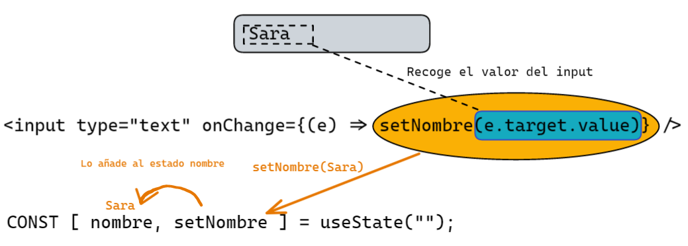
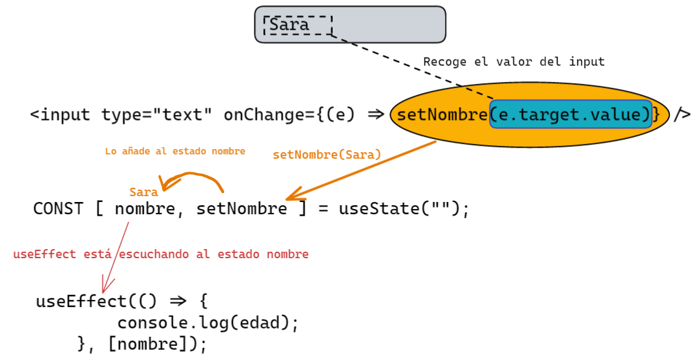

# [Bootcamp Web Developer Full Stack](https://www.thebridge.tech/bootcamps/bootcamp-fullstack-developer/)

### HTML, CSS,  JS, ES6, Node.js, Frontend, Backend, Express, React, MERN, testing, DevOps

## ¿Qué es un componente funcional?

Un componente funcional es una función que **recibe** el objeto **Props** y **retorna** un **ReactNode**. *(ReactNode puede ser un elemento html, un string, un booleano, Jsx, entre otros tipos de datos).*

La forma más sencilla de definir un componente es escribir una función de JavaScript. Se le pone el nombre la primera en Mayúsculas para saber que es un componente.

* **Creamos componente Welcome:**
```js
// importar React de la biblioteca.
import React from 'react';

//Componente funcional -> 
function Welcome(props) {
    return (
        <h1>Hello, {props.name}</h1>
    )
}
export default Welcome;
```

En el componente App renderizamos Welcome muchas veces con otros nombres:

* Cogemos como ejemplo la estructura de **App()**.
```js
function App() {
    return (
        <div>
            <Welcome name="Sara" />
            <Welcome name="Carmen" />
            <Welcome name="Elice" />
        </div>
    );
}
export default App;
```
## ¿Qué es State?

1. El **State**, es mutable, es algo que puede variar.
2. Está **encapsulado**, no debemos mutarlo indiscriminadamente como pisamos una variable. 
3. El **State** es un objeto que es propiedad del componente donde se lo declara y su **scope** está limitado al mismo componente. 
4. Suele ser el punto de partida para obtener los datos que luego van a ser pasados como **props a los hijos**.
5. La forma de **cambiar** el estado de un componente es utilizando el método **setState**. 
6. Luego React se encarga de hacer todos los cambios de forma **asíncrona, actualizar** el estado, el **virtual DOM** y el **DOM** por nosotros.

Para poder utilizar **useState** hay que importarlo primero, y la estructura suya es así:

```js
// import useState
import {useState} from 'react';

// [variable del useState, modificador de la variable useState] = useState(Valor inicial de su variable).
const [nombre, setNombre] = useState("");
const [edad, setEdad] = useState("");
```
#### Ejemplo:

1. **Recoge** el dato del input "Sara".
2. **setNombre** cambia el estado nombre, por cada cambio que escuche al input.
3. El valor se recoge con **e.target.value**.



* * *
## useEffect: 

* UseEffect es un hook de React que permite utilizar el ciclo de vida del componente o escuchar en todo momento el cambio de un estado que le asignemos.

```js
//import
import React, { useEffect } from 'react'

// Está a la espera de cualquier cambio que haya en edad.
    useEffect(() => {
        console.log(nombre);
    }, [nombre]);
```



* * *

### Ejemplo conjunto

* Creamos en la carpeta component el archivo **Tercero.js** y pegamos este código.
* En **App.js** importamos Tercero.js y colocamos su etiqueta componente < Tercero />.
* *Ejemplo de la evolución de recogida de datos (1º, 2º, 3º)*

**Tercero.js**

```js
//importar React y los elementos useState y useEffect.
import React, { useState, useEffect } from "react";
import Welcome from './Welcome';

//Componente Clase
function Tercero() {

    // Estados para el nombre, la edad e info.
    const [nombre, setNombre] = useState("");
    const [edad, setEdad] = useState("");
    const [info, setInfo] = useState("");

    // Está a la espera de cualquier cambio que haya en nombre.
    useEffect(() => {
        if (nombre != ""){
            console.log(`${nombre}`)
        } 
    }, [nombre]);

    // Está a la espera de cualquier cambio que haya en edad.
    useEffect(() => {
        if (edad != ""){
            console.log(edad);
        } 
    }, [edad]);

    useEffect(() => {
        console.log("Carga la página");
    }, []);

    // Función que se ejecuta cuando se aprieta el botón.
    const enviar = () => {
        console.log(`Su nombre es ${nombre} y tienes ${edad}`);

        // Guarda nombre y edad en el estado de info.
        setInfo([nombre, edad]);
    }

    return (
        <div>
            <Welcome name={nombre}/>
            {/* Inputs donde se recogelos valores si hay un cambio, y se mete al state. */}
            <input type="text" className="nombre" placeholder="Nombre" onChange={(e) => setNombre(e.target.value)} />
            <input type="text" className="edad" placeholder="Edad" onChange={(e) => setEdad(e.target.value)} />

            <p><span>(e.target.value)</span></p>

            {/* Cuando se aprieta al botón dicha función recoge los valores de los states nombre y edad y los mete en info */}
            <input type="button" value="Enviar" className="boton" onClick={() => enviar()} />

            {/* En caso de que exista info se pintará el párrafo con la información del user.*/}
            {info ? <p> Hola {info[0]}, tienes {info[1]}</p> : ""}
        </div>
    )
}

//Exportar el componente
export default Tercero;
```
**App.js**

Modificar el archivo de **App.js**

```js
// import logo from './logo.svg';
import './App.css';
import Welcome from './component/Welcome';
import Tercero from './component/Tercero';


function App() {

  
  return (
    <div className="App">
      {/* <Welcome name="Users"/> */}
      <Tercero/>
    </div>
  );
}

export default App;
```


