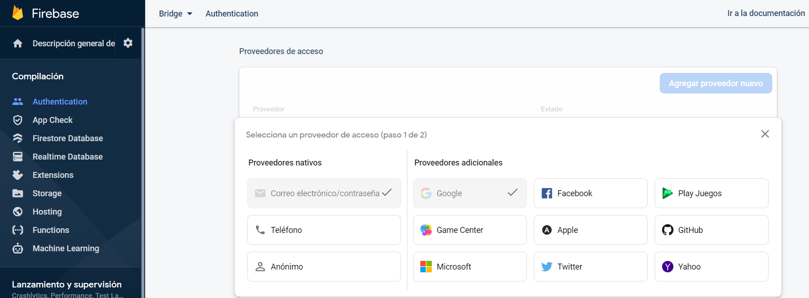

# [Bootcamp Web Developer Full Stack](https://www.thebridge.tech/bootcamps/bootcamp-fullstack-developer/)

### HTML, CSS,  JS, ES6, Node.js, Frontend, Backend, Express, React, MERN, testing, DevOps

# Firebase Auth


### Introducción
Firebase Authentication se usa para permitir que los usuarios **accedan** a la app con uno o más métodos de acceso, que incluyen el acceso con:
<div style="display:flex;">
    <ul>
    <li><b>Email y contraseña</b></li>
    <li><b>Google</b></li>
    <li><b>Facebook</b></li>
    <li><b>Play Juegos</b></li>
    <li><b>Teléfono</b></li>
    <li><b>Apple</b></li>
    <li><b>Microsoft</b></li>
    <li><b>Game Center</b></li>
    <li><b>GitHub</b></li>
    <li><b>Yahoo</b></li>
    </ul>
    
</div>
   

### Comandos Email/Pass:

FireBase tiene unas funciones para saber que se va a realizar una autentificación, y dependiendo del método que se vaya hacer(email, tlf, facebook...), tendremos que mirar en la documentación y aplicar y llamar a unas funciones u otras.

* **Activar Autentificación**
```js
//Inicializa Firebase Authentication y obtiene una referencia al servicio.
const auth = getAuth();
```
* **Crear User correo y pass**
```js
//Esta función sirve para crear un user con su email y password
createUserWithEmailAndPassword(auth, email, password);
```

* **Verificar Correo**
```js
//Esta función sirve para verificar el email y password.
signInWithEmailAndPassword(auth, email, pass);
```

* **Desloguear**
```js
//Esta función sirve para desloguear.
signOut(auth);
```

* Para poder obtener estas funciones las recogemos con este **import**: 
```js
import { getAuth, createUserWithEmailAndPassword, signInWithEmailAndPassword, signOut } from "firebase/auth";

```

[Documentación para email y Pass](https://firebase.google.com/docs/auth/web/password-auth?authuser=1)

* * * 

### Estructura y ejemplo de Firebase Auth REACT

Añadimos el código en el **archivo app.js** del proyecto creado de React.

```js
import './App.css';
import { initializeApp } from "https://www.gstatic.com/firebasejs/9.6.1/firebase-app.js";
import React, { useState, useEffect } from "react";
import { getAuth, createUserWithEmailAndPassword, signInWithEmailAndPassword, signOut, GoogleAuthProvider, signInWithPopup, getRedirectResult } from "https://www.gstatic.com/firebasejs/9.6.1/firebase-auth.js";

const firebaseConfig = {
  // ?????? //
};


function App() {

  const app = initializeApp(firebaseConfig);
  const auth = getAuth();
  const [email, setEmail] = useState("");
  const [pass, setPass] = useState("");


  const register = () => {
    createUserWithEmailAndPassword(auth, email, pass)
      .then(() => {
        console.log("Creado el usuario");
      })
      .catch((e) => {
        console.log("Error: " + e);
      }
      )
  }

  const login = () => {
    signInWithEmailAndPassword(auth, email, pass)
      .then((userCredential) => {
        console.log("Login con usuario: " + userCredential.user.email);
      })
      .catch((e) => {
        console.log("Error: " + e);
      });
  }
  const deslogarUsuario = () => {
    signOut(auth)
      .then(() => {
        console.log("Logout");
      })
      .catch((e) => {
        console.log("Error: " + e);
      });
  }


const auth = getAuth();

  return (
    <div className="App">
      <div className="container">
        {/* <!-- Barra de navegación --> */}
        <nav className="navbar navbar-expand-lg navbar-dark bg-dark">
          <div className="container-fluid">
            <a className="navbar-brand" href="#">Navbar</a>
            <button className="navbar-toggler" type="button" data-bs-toggle="collapse"
              data-bs-target="#navbarSupportedContent" aria-controls="navbarSupportedContent"
              aria-expanded="false" aria-label="Toggle navigation">
              <span className="navbar-toggler-icon"></span>
            </button>
            <div className="collapse navbar-collapse" id="navbarSupportedContent">
              <ul className="navbar-nav me-auto mb-2 mb-lg-0">
                <li className="nav-item">
                  <a className="nav-link" href="#" data-bs-toggle="modal" data-bs-target="#SignInModal">SingIn</a>
                </li>
                <li className="nav-item">
                  <a className="nav-link" href="#" data-bs-toggle="modal" data-bs-target="#SignUpModal">SingUp</a>
                </li>
                <li className="nav-item">
                  <a className="nav-link" href="#" id="aLogOut" onClick={() => deslogarUsuario()}>LogOut</a>
                </li>
              </ul>
            </div>
          </div>
        </nav>
      </div>

        // Modal Registro
        // Modal
      <div className="modal fade" id="SignUpModal" tabIndex="-1" aria-labelledby="exampleModalLabel" aria-hidden="true">
        <div className="modal-dialog">
          <div className="modal-content">
            <div className="modal-header">
              <h5 className="modal-title" id="exampleModalLabel">SingUp</h5>
              <button type="button" className="btn-close" data-bs-dismiss="modal" aria-label="Close"></button>
            </div>
            <div className="modal-body">
              <form id="SignUpForm">
                <div className="form-group">
                  <input type="text" id="SignUpEmail" className="form-control form-control-lg" placeholder="Email" required onChange={(e) => setEmail(e.target.value)} />
                  <br />
                  <br />
                  <input type="password" id="SignUpPass" className="form-contol form-control-lg" placeholder="Password" required onChange={(e) => setPass(e.target.value)} />
                </div>
                <br />
                <br />
                <button type="button" className="btn btn-primary" onClick={() => { register() }}>SingUp</button>
              </form>
            </div>
          </div>
        </div>
      </div>

      {/* <!-- Modal Login -->
        <!-- Modal --> */}
      <div className="modal fade" id="SignInModal" tabIndex="-1" aria-labelledby="exampleModalLabel" aria-hidden="true">
        <div className="modal-dialog">
          <div className="modal-content">
            <div className="modal-header">
              <h5 className="modal-title" id="exampleModalLabel">SingIn</h5>
              <button type="button" className="btn-close" data-bs-dismiss="modal" aria-label="Close"></button>
            </div>
            <div className="modal-body">
              <form id="SignInForm">
                <div className="form-group">
                  <input type="text" id="SignInEmail" className="form-control form-control-lg" placeholder="Email" required onChange={(e) => setEmail(e.target.value)} />
                  <br />
                  <br />
                  <input type="password" id="SignInPass" className="form-contol form-control-lg" placeholder="Password" required onChange={(e) => setPass(e.target.value)} />
                </div>
                <br />
                <br />
                <button type="button" className="btn btn-primary" onClick={() => { login() }}>SingIn</button>
                <input type="button" value="Google" id="loginGoogle" onClick={() => { loginGoogle() }} />
              </form>
            </div>
          </div>
        </div>
      </div>
    </div>
  );
}

export default App;

```

[DOCUMENTACION_FIREBASE_AUTH](https://firebase.google.com/docs/auth?authuser=1&hl=es)


* * *

### Firebase Auth REACT   - GOOGLE - :

Creamos otro proyecto de React o sustituimos los archivos que hay por los nuevos.

**App.js**

Es la página que visualiza la página Home o Login
```js
import { useState, useEffect } from 'react';

import Login from './components/Login';
import Home from './components/Home';
import firebase from './service/firebase';

import './App.css';

function App() {
  const [user, setUser] = useState(null);

// UseEffect: escucha si hay cambios en la selección del correo del usuario en gmail.
  useEffect(() => {
    firebase.auth().onAuthStateChanged(user => {
      setUser(user);
    })
  }, [])

  console.log(user);

  return (
    <div className="app">
      {user? <Home user={user} /> : <Login/>}
    </div>
  );
}

export default App;
```
### Component

Creamos una carpeta de components de dentro de src:

* Creamos archivo **Home.js**
* Creamos archivo **Login.js**

#### Home.js

Es la página que aparece después de la autentificación y logueado del usuario.

```js
import React from 'react';
import { auth } from '../service/firebase'
import '../App.css';

const Home = ({ user }) => {
  return (
    <div className="home">
      <h1>Hello, <span></span>{user.displayName}</h1>
      

      // Al clickear se desloguea con (auth.signOut())
      <button className="button signout" onClick={() => auth.signOut()}>Sign out</button>
    </div>
  )
}

export default Home;
```
#### Login.js

Es la página donde aparece el botón para autentificar con Google
```js
import { signInWithGoogle } from "../service/firebase";

import '../App.css';

const Login = () => {
  return (
    <div>
      <button className="button" onClick={signInWithGoogle}><i className="fab fa-google"></i>Sign in with google</button>
    </div>
  )
}

export default Login;
```

### Service

Creamos la carpeta Service y añadimos dentro el archivo **firebase.js**.

**firebase.js**

```js
import firebase from 'firebase/compat/app'

import 'firebase/compat/auth';

const firebaseConfig = {
    // ????? //
};

// Initialize Firebase 
firebase.initializeApp(firebaseConfig);

// Recoge que va haber una autentificación
export const auth = firebase.auth();

// La autentificación se va hacer de Google
const provider = new firebase.auth.GoogleAuthProvider();

//Espera a que selecciones el email que este añadido o guardado en el navegador
provider.setCustomParameters({ prompt: 'select_account' });

// Se registra con el email que se ha seleccionado
export const signInWithGoogle = () => auth.signInWithPopup(provider);

export default firebase
```

#### [Docu AuthGoogle](https://dev.to/mdamirgauhar/firebase-google-authentication-with-react-gop)