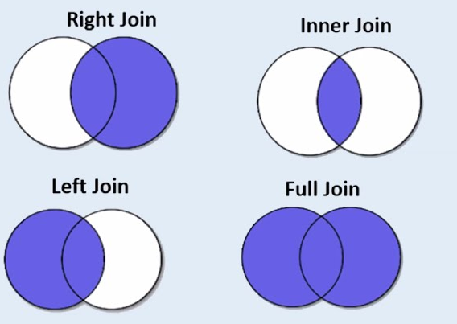

# [Bootcamp Web Developer Full Stack](https://www.thebridge.tech/bootcamps/bootcamp-fullstack-developer/)

### HTML, CSS,  JS, ES6, Node.js, Frontend, Backend, Express, React, MERN, testing, DevOps

# Consultas con JOIN en MySQL



Los join se usan para recuperar datos de varias tablas al mismo tiempo, son una alternativa a las subconsultas y las tablas tienen que estar relacionadas de algún modo, normalmente con una FK.

- En Mysql, como en la mayoría de las bases de datos relacionales hay diferentes tipos de join:

- Vamos a suponer que tenemos una tienda online con una tabla clientes, una productos y una tabla pedidos.

## INNER JOIN 

También se puede usar como JOIN. En este caso la sentencia va a devolver la intersección. 

- Un ejemplo sería obtener el nombre de todos los clientes con pedidos y el precio total del pedido:

```SQL 
    SELECT clientes.nombre,pedidos.total_pedido
    FROM clientes
    JOIN pedidos ON clientes.id = pedidos.fk_id_cliente
```

## LEFT JOIN

En este caso la sentencia va a devolver los datos que tiene en la primera tabla (clientes) con los datos que tiene en común con la segunda tabla (pedidos). Es decir, la primera tabla completa, incluyendo la intersección.

- Ejemplo de LEFT JOIN:  Sacar todos los clientes que tengan pedidos, y sus pedidos, y los clientes que no tengan pedidos.

```SQL 
    SELECT clientes.nombre,pedidos.total_pedido
    FROM clientes
    LEFT JOIN pedidos ON clientes.id = pedidos.fk_id_cliente
```

## RIGHT JOIN 

Este caso es como el anterior pero a la inversa, la sentencia va a devolver los datos que tiene en la segunda tabla, con los datos que tiene en común con la primera tabla. Es decir, como antes, segunda tabla completa con la intersección inluida. 


- Ejemplo: si tenemos dos tablas de pedidos y productos y queremos sacar todos los productos y los pedidos asociados, si los tienen.

```SQL 
    SELECT producto.nombre,pedidos.total_pedido
    FROM productos
    RIGHT JOIN pedidos ON productos.id = pedidos.fk_id_producto
```

[DOCUMENTACION_MYSQL](https://dev.mysql.com/doc/refman/8.0/en/join.html)
