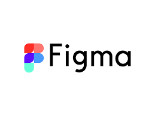
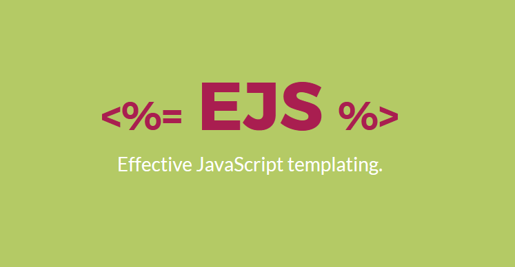

# [Bootcamp Web Developer Full Stack](https://www.thebridge.tech/bootcamps/bootcamp-fullstack-developer/)

## HTML, CSS, JS, ES6, Node.js, Frontend, Backend, Express, React, MERN, testing, DevOps

* * * 

### HTML y CSS

<table>
<tr>
<th style="width:10%">
Flukeout
</th>
<td>
Juego interactivo con el código para poder aprender a realizar selecciones para el CSS:

https://flukeout.github.io/
https://www.w3.org/TR/selectors-3/#pseudo-classes

<td>

</td>
</tr>
<!-- ******************************************************* -->

<tr>
<th>
Flexbox
</th>
<td>
Maquetar módulos adaptables para web tales como listados en filas de N bloques suponía crear una larga lista de estilos css que cambiaban según la resolución de los diferentes dispositivos.

https://www.yunbitsoftware.com/blog/2017/03/30/flexbox-css3-tutorial-descripcion-ejemplos-html/
https://css-tricks.com/snippets/css/a-guide-to-flexbox/

<td>

</td>
</tr>

<!-- ******************************************************* -->

<tr>
<th>
Frog
</th>
<td>
Juego interactivo para entender los conceptos básicos del Flex-box:

https://flexboxfroggy.com/#es

<td>

</td>
</tr>

<!-- ******************************************************* -->

<tr>
<th>
Bootstrap
</th>
<td>
Bootstrap es un framework front-end utilizado para desarrollar aplicaciones web y sitios mobile first, o sea, con un layout que se adapta a la pantalla del dispositivo utilizado por el usuario.

https://getbootstrap.com/
https://kenwheeler.github.io/slick/  (Slick)

<td>

</td>
</tr>

<!-- ******************************************************* -->
* * *
<tr>
<th>
Fonts
</th>
<td>
Página de búsqueda y descarga de estilos de letra:

https://fonts.google.com/

<td>

</td>
</tr>
</table>
<!-- ******************************************************* -->
 

* * *

<!--! **************OOOOOOOOOOOOOOOOOOOOOOOOOOO************** -->

### Git y GitHub
<table>
<tr>
<th>
Git y GitHub:
</th>
<td>
Tutoriales de comandos de GitHub para añadir extras a lo aprendido.

https://www.atlassian.com/es/git/tutorials/learn-git-with-bitbucket-cloud

https://kinsta.com/es/base-de-conocimiento/git-vs-github/

<td>

</td>
</tr>

</table>
 

* * *
<!--! **************OOOOOOOOOOOOOOOOOOOOOOOOOOO************** -->

### Gráficas
Bibliotecas de JavaScript gratuita de código abierto para la visualización de datos:

<table>

<tr>
<th>Chart JS</th>
<td> 

https://www.chartjs.org/ 

</td>

<td style="text-align:center">
</td>
</tr>
<!-- ******************************************-->
<tr>
<th>ChartList</th>
<td> 

https://gionkunz.github.io/chartist-js/

</td>

<td style="text-align:center">
</td>
</tr>
<!-- ******************************************-->
<tr>
<th>Solar System</th>
<td> 

https://codepen.io/juliangarnier/pen/idhuG

</td>

<td style="text-align:center">
</td>
</tr>
<!-- ******************************************-->
<tr>
<th>Globe</th>
<td> 

https://codepen.io/jorin/pen/YNajXZ

</td>

<td style="text-align:center">
</td>
</tr>
<!-- ******************************************-->
<tr>
<th>AirportMap</th>
<td> 

https://codepen.io/shshaw/pen/vJNMQY

</td>

<td style="text-align:center">
</td>
</tr>
</table>

<!--! **************OOOOOOOOOOOOOOOOOOOOOOOOOOO************** -->

* * * 

### Organización de tareas, bocetos, formatos vistas

<table>
<tr>
<th>Trello</th>
<td>Trello es una fabulosa herramienta para la organización de tareas. Es ideal para la coordinación de equipos de trabajo y se basa en la metodología Kanban, la cual propone un sistema de uso colaborativo.

https://trello.com/login</td>
<td>

</td>
</tr>
<!-- ******************************************-->
<tr>
<th>Excalidraw</th>
<td>Excalidraw es un programa con el que podrás realizar diagramas de flujo o representar ideas de forma esquemática a mano alzada como si estuvieras delante de una pizarra, pero desde tu navegador web.

https://excalidraw.com/</td>

<td>

</td>
</tr>
<!-- ******************************************-->
<tr>
<th>Figma</th>
<td>Figma es una herramienta de prototipado web y editor de gráficos vectorial, que a diferencia de las otras herramientas, se aloja en la web.
Puedes compartir el proyecto con tu equipo y hacer modificaciones en la misma mesa de trabajo (UX/UI).

https://www.figma.com/</td>

<td>

</td>
</tr>

</table>

<!--! **************OOOOOOOOOOOOOOOOOOOOOOOOOOO************** -->
* * * 

 ### Motores de plantilla
 
<table>
<tr>
<th>PUG</th>
<td> Tutorial de la estructura del código de Pug:

https://pugjs.org/language/case.html

Traductor de HTML a PUG y viceversa. Con solo insertar tu código en HTML/PUG te lo devuelve traducido a PUG/HTML.
https://pughtml.com/

https://riptutorial.com/Download/pug-es.pdf (Manual)

 </td>
<td>

</td>
</tr>

<tr>
<th>EJS</th>
<td> Tutorial de la estructura del código de Pug.

https://pugjs.org/language/case.html

Traductor de HTML a PUG y viceversa. Con solo insertar tu código en HTML/PUG te lo devuelve traducido a PUG/HTML.

https://riptutorial.com/Download/pug-es.pdf 

 </td>
<td>

</td>
</tr>
</table>

<!--! **************OOOOOOOOOOOOOOOOOOOOOOOOOOO************** -->

* * *
### Base de Datos
 
 <table>

<tr>
<th>BD Relacionales</th>
<td> Para perfeccionar las buenas prácticas en las bases de datos creadas.

https://videlcloud.wordpress.com/2017/03/05/buenas-practicas-para-el-diseno-de-base-de-datos/ (Tutorial Intro)

https://juannava64.files.wordpress.com/2012/05/sistemas-gestores-de-bases-datos_ejercicios-ver3-4.pdf (Manual y ejecicios)

https://sequelize.org/ (Sequelize)

https://www.npmjs.com/package/mysql  (mysql node.js)

 </td>
<td>

</td>
</tr>
</table>
 

<!--! **************OOOOOOOOOOOOOOOOOOOOOOOOOOO************** -->

### Practicar código

<table>
<tr>
<th>
Prácticas de códigos
</th>
<td>

Programa para ejercitar múltiples lenguajes de programación con diversos ejercicios. Se puede enlazar la puntuación a tu porpio Github:

https://www.codewars.com

<td>

</td>
</tr>

</table>
 

<!--! **************OOOOOOOOOOOOOOOOOOOOOOOOOOO************** -->

* * * 

### Varios

<table>

<tr>
<th>Expresiones regulares</th>
<td> Biblioteca y gestor de formas de expresiones regulares. Puedes insertar o crear tu expresión regular y te devolverá qué se acepta y que no:

https://regex101.com/

</td>
<td>

</td>
</tr>

<tr>
<th>Programación Orientada a Objetos</th>
<td> 

http://www.it.uc3m.es/java/git-gisc/units/oo-herencia/slides/ProgramacionOrientadaAObjetos.pdf

</td>
<td>

</td>
</tr>

<tr>
<th>APIS</th>
<td> Colección de múltiples APIS:

https://rapidapi.com/hub
</td>

<td>

</td>
</tr>

<tr>
<th>Puppeteer</th>
<td> 
Puppeteer es una librería de Node.js que permite automatizar acciones sobre los navegadores de Google:

https://codecept.io/helpers/Puppeteer/#clearcookie

https://runebook.dev/es/docs/codeceptjs/helpers/puppeteer/index

</td>
<td>

</td>
</tr>

</table>
