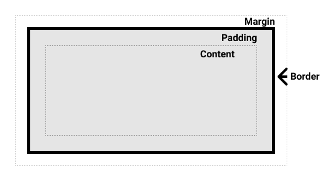

# [Bootcamp Web Developer Full Stack](https://www.thebridge.tech/bootcamps/bootcamp-fullstack-developer/)

### HTML, CSS,  JS, ES6, Node.js, Frontend, Backend, Express, React, MERN, testing, DevOps

# Modelo de cajas

## Cajas en bloque y en línea
El hecho de ser en bloque o en línea definen el comportamiento de la caja dentro del flujo de la aplicación.

### Comportamiento de una caja en bloque: 

- La caja fuerza un salto de línea al llegar al final de la línea.

- La caja se extenderá en la dirección de la línea para llenar todo el espacio disponible que haya en su contenedor. En la mayoría de los casos, esto significa que la caja será tan ancha como su contenedor, y llenará el 100% del espacio disponible.

- Se respetan las propiedades width y height.

- El relleno, el margen y el borde mantienen a los otros elementos alejados de la caja.

Los h y los p, por ejemplo, son elementos en bloque.

### Comportamiento de una caja en línea:

- La caja no fuerza ningún salto de línea al llegar al final de la línea.

- Las propiedades width y height no se aplican.

- Se aplican relleno, margen y bordes verticales, pero no mantienen alejadas otras cajas en línea.

- Se aplican relleno, margen y bordes horizontales, y mantienen alejadas otras cajas en línea.

Por ejemplo, los a y los span son elementos en línea.

Esto que hemos visto representa la forma predeterminada en la que se comportan los elementos en HTML, aunque Flexbox dispone unas reglas que permiten modificar los comportamientos de los elementos, como veremos más adelante.

La propiedad CSS que permite modificar el modo en el que se muestra un elemento es display.

## Descripción del modelo de cajas

Se aplica a cajas que presentan comportamiento en bloque; las cajas con comportamiento en línea solo usan una parte del comportamiento definido en el modelo de cajas. El modelo define cómo funcionan juntas las diferentes partes de una caja (margen, borde, relleno y contenido) para crear una caja que puedas ver en tu página.

Veamos dichas partes por separado: 

- Content (contenido): Área dónde se muestra el contenido, la podemos modificar con width y height

- Padding (relleno): Espacio en blanco que rodea al contenido

- Border (borde): Borde que envuelve el contenido y el relleno

- Margin (margen): Espacio en blanco entre la caja y otros elementos

Todas estas partes son configurables. 

Para simplificar esta parte, vamos a ver un breve resumen en este enlace: 

[MODELO DE CAJAS](https://developer.mozilla.org/es/docs/Learn/CSS/Building_blocks/The_box_model)

Más información: 

- [ELEMENTOS_BLOQUE](https://developer.mozilla.org/es/docs/Glossary/Block/CSS)
- [DISPLAY](https://developer.mozilla.org/es/docs/Web/CSS/display)
